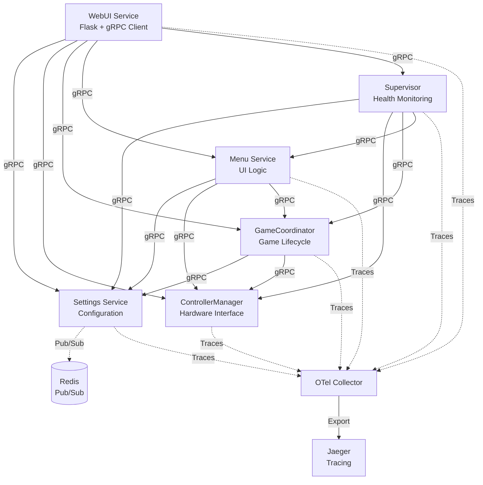
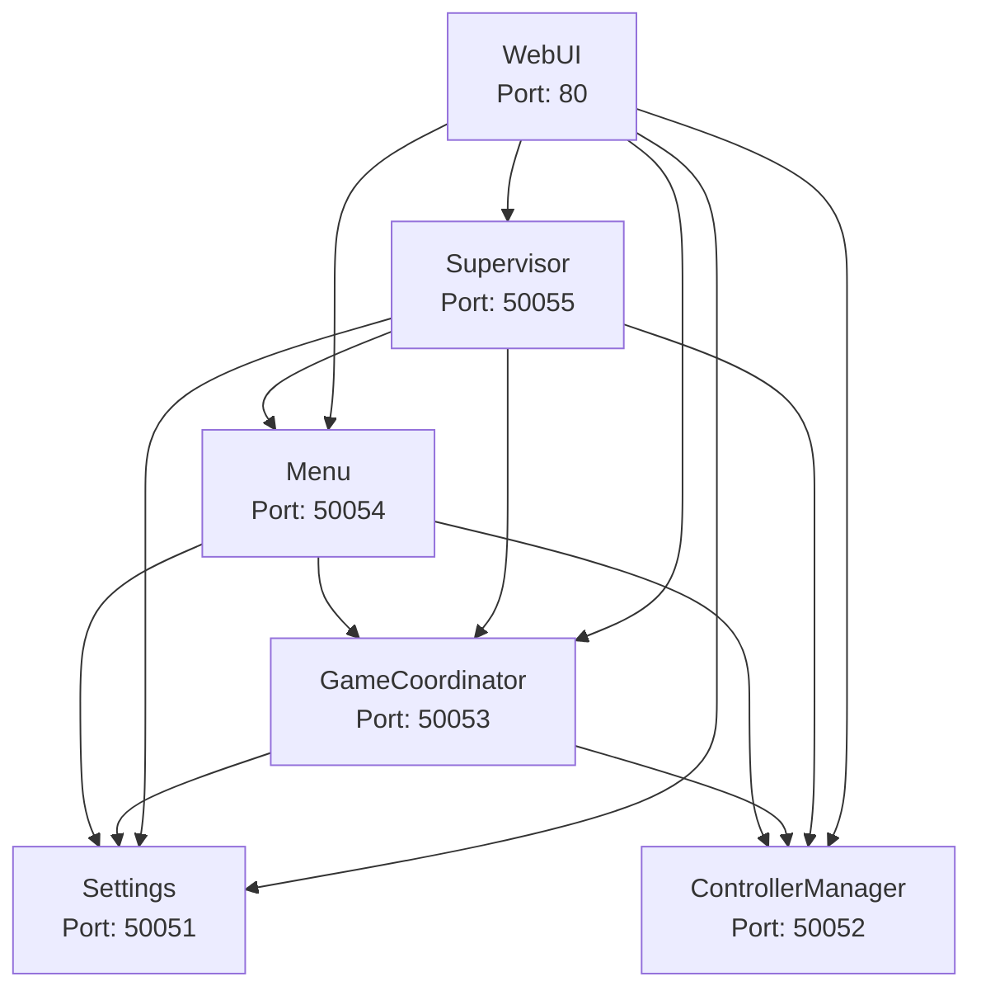
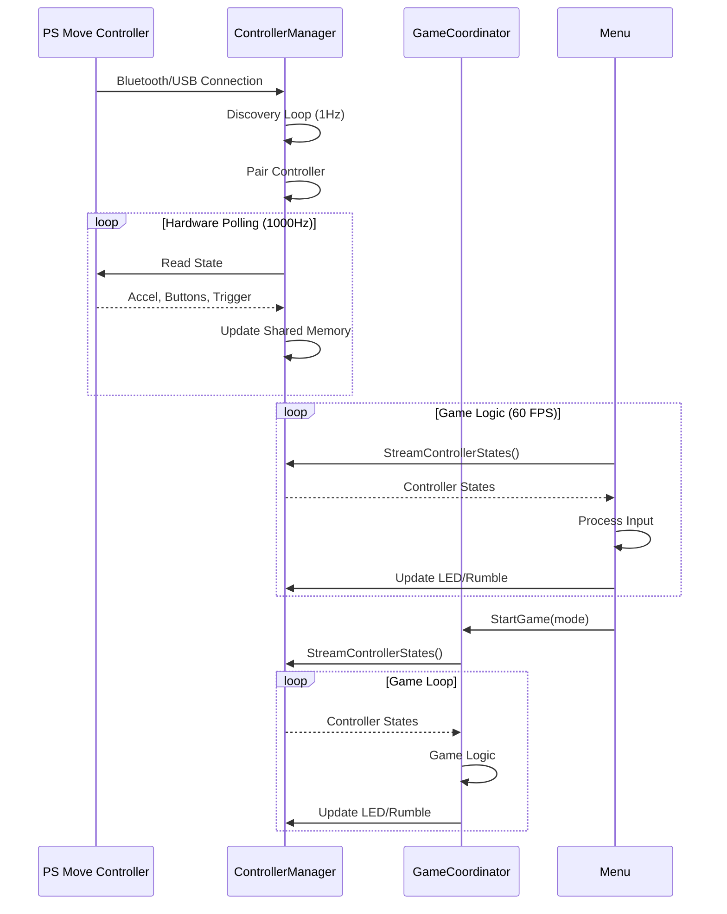
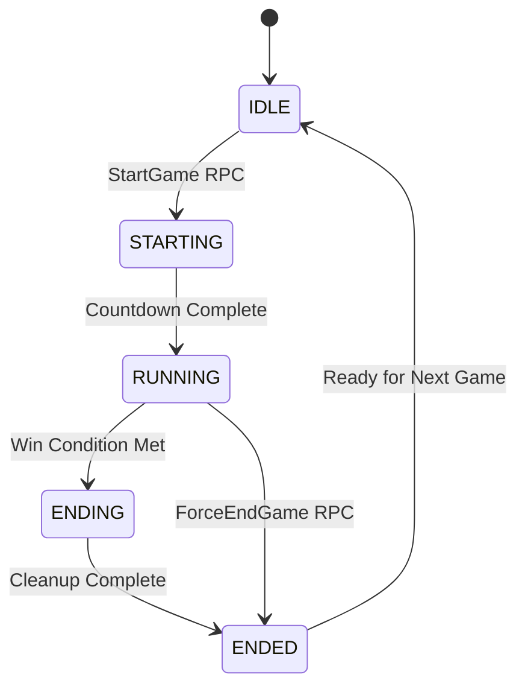
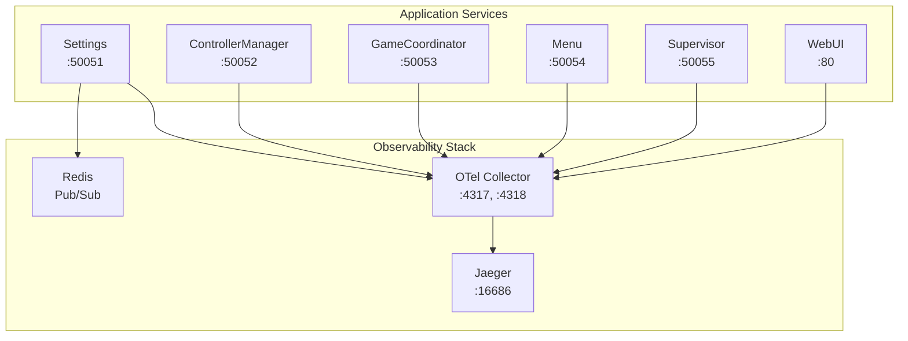

# JoustMania Root Directory Cleanup Plan

**Date:** 2026-01-10
**Context:** After implementing microservices architecture, many root-level Python files are now duplicates or obsolete.

---

## Analysis of Root Python Files

### ❌ REMOVE - Duplicates (Already in services/)

These files have been moved to `services/` and are now duplicates:

1. **controller_manager.py** → `services/controller_manager/process.py`
   - Queue-based IPC version
   - Replaced by gRPC server in `services/controller_manager/server.py`
   - **Action:** DELETE

2. **game_coordinator.py** → `services/game_coordinator/process.py`
   - Queue-based IPC version
   - Replaced by gRPC server in `services/game_coordinator/server.py`
   - **Action:** DELETE

3. **settings_process.py** → `services/settings/process.py`
   - Queue-based IPC version
   - Replaced by gRPC server in `services/settings/server.py`
   - **Action:** DELETE

4. **process_supervisor.py** → `services/supervisor/process.py`
   - Queue-based IPC version
   - Replaced by gRPC server in `services/supervisor/server.py`
   - **Action:** DELETE

### ❌ REMOVE - Duplicates (Already in core/)

These files have been moved to `core/`:

5. **controller_state.py** → `core/controller_state.py`
   - **Action:** DELETE (already in core/)

6. **controller_process.py** → `core/controller_process.py`
   - **Action:** DELETE (already in core/)

7. **common.py** → `core/common.py`
   - **Action:** DELETE (already in core/)

### ❌ REMOVE - Duplicates (Already in utils/)

These files have been moved to `utils/`:

8. **pair.py** → `utils/pair.py`
   - **Action:** DELETE (already in utils/)

9. **colors.py** → `utils/colors.py`
   - **Action:** DELETE (already in utils/)

10. **piaudio.py** → `utils/piaudio.py`
    - **Action:** DELETE (already in utils/)

### ⚠️ DECIDE - Legacy Orchestrator

11. **piparty.py** (3000+ lines)
    - Old Queue-based orchestrator
    - Uses multiprocessing.Queue for IPC
    - **Options:**
      - A) DELETE - We have `piparty_grpc.py` now
      - B) KEEP - For backward compatibility until gRPC fully tested
      - C) ARCHIVE - Move to `legacy/` folder
    - **Recommendation:** Move to `legacy/` folder for now
    - **Note:** Check if `joust.py` or setup scripts still reference this

### ✅ KEEP - New gRPC Infrastructure

12. **piparty_grpc.py**
    - New gRPC-based orchestrator
    - Replaces piparty.py
    - **Action:** KEEP

13. **grpc_clients.py**
    - gRPC client library for all services
    - **Action:** KEEP

### ✅ KEEP - Web Interface

14. **webui.py**
    - Web interface for JoustMania
    - Still needed for HTTP server
    - **Action:** KEEP

### ✅ KEEP - Utilities & Tools

15. **audio_tool.py**
    - Audio testing utility
    - **Action:** KEEP (useful for debugging)

16. **clear_devices.py**
    - Device cleanup utility
    - **Action:** KEEP (useful for maintenance)

17. **controller_util.py**
    - Controller utility functions
    - **Action:** KEEP (or move to utils/)

18. **manualpair.py**
    - Manual pairing tool
    - **Action:** KEEP (useful for setup)

19. **update.py**
    - Update script
    - **Action:** KEEP (system maintenance)

20. **playwav.py**
    - Audio playback utility
    - **Action:** KEEP (or move to utils/)

### ✅ KEEP - System Integration

21. **jm_dbus.py**
    - D-Bus integration (Linux)
    - **Action:** KEEP

22. **win_jm_dbus.py**
    - D-Bus integration (Windows)
    - **Action:** KEEP

### ✅ KEEP - Testing

23. **conftest.py**
    - pytest configuration (mocks psmove)
    - **Action:** KEEP

24. **joust_test.py**
    - Test file
    - **Action:** KEEP (or move to testing/)

25. **pacemanager_test.py**
    - Test file
    - **Action:** KEEP (or move to testing/)

26. **test_orchestrator.py**
    - Test file
    - **Action:** KEEP (or move to testing/)

### ✅ KEEP - Game Utilities

27. **pacemanager.py**
    - Pace management for game dynamics (speed/intensity transitions)
    - Used by `games/ffa.py` (Free-For-All mode)
    - Manages weighted random transitions between game paces
    - **Action:** KEEP - Actively used

28. **player.py**
    - Player management classes
    - Used by `games/ffa.py` and potentially other game modes
    - **Action:** KEEP - Likely used by game implementations

### ✅ KEEP - Package Init

29. **__init__.py**
    - Package initialization
    - **Action:** KEEP

30. **base_logger.py**
    - Logging infrastructure
    - **Action:** KEEP (or move to core/)

---

## Cleanup Strategy

### Phase 1: Safe Removals (Confirmed Duplicates)

```bash
# Create a backup first
mkdir -p archive/root-backup-$(date +%Y%m%d)
cp *.py archive/root-backup-$(date +%Y%m%d)/

# Remove confirmed duplicates
rm controller_manager.py
rm game_coordinator.py
rm settings_process.py
rm process_supervisor.py
rm controller_state.py
rm controller_process.py
rm common.py
rm pair.py
rm colors.py
rm piaudio.py
```

**Impact:** None - These files exist in their new locations (services/, core/, utils/)

### Phase 2: Archive Legacy

```bash
# Create legacy folder
mkdir -p legacy

# Move old orchestrator
mv piparty.py legacy/

# Update any references
# Check: joust.py, setup.sh, systemd files
```

**Impact:** Need to update any scripts that reference `piparty.py`

### Phase 3: Organize Utilities

```bash
# Move utilities to utils/
mv controller_util.py utils/
mv playwav.py utils/
mv base_logger.py core/

# Update imports in files that use these
```

**Impact:** Minor - Need to update import statements

### Phase 4: Organize Tests

```bash
# Move tests to testing/
mv joust_test.py testing/
mv pacemanager_test.py testing/
mv test_orchestrator.py testing/
```

**Impact:** Minor - Update test runner if needed

### Phase 5: Investigate & Remove Unused

```bash
# Check usage of these files
grep -r "import pacemanager" .
grep -r "import player" .

# If unused, remove
rm pacemanager.py  # if unused
rm player.py       # if unused
```

**Impact:** Depends on usage

---

## Updated Root Directory Structure (After Cleanup)

```
JoustMania/
├── piparty_grpc.py          # New gRPC orchestrator (MAIN ENTRY POINT)
├── grpc_clients.py          # gRPC client library
├── webui.py                 # Web interface
├── update.py                # System updates
├── conftest.py              # pytest configuration
├── __init__.py              # Package init
│
├── jm_dbus.py               # D-Bus integration (Linux)
├── win_jm_dbus.py           # D-Bus integration (Windows)
│
├── audio_tool.py            # Audio testing utility
├── clear_devices.py         # Device cleanup utility
├── manualpair.py            # Manual pairing tool
│
├── core/                    # Core infrastructure
│   ├── controller_state.py
│   ├── controller_process.py
│   ├── common.py
│   └── base_logger.py       # MOVED from root
│
├── utils/                   # Utilities
│   ├── pair.py
│   ├── colors.py
│   ├── piaudio.py
│   ├── controller_util.py   # MOVED from root
│   └── playwav.py          # MOVED from root
│
├── services/                # Microservices
│   ├── settings/
│   ├── controller_manager/
│   ├── game_coordinator/
│   ├── menu/
│   └── supervisor/
│
├── testing/                 # Tests
│   ├── joust_test.py       # MOVED from root
│   ├── pacemanager_test.py # MOVED from root
│   └── test_orchestrator.py # MOVED from root
│
└── legacy/                  # Archived code
    └── piparty.py          # Old Queue-based orchestrator
```

---

## Files to Update After Cleanup

### 1. **joust.py** (Main entry point)
- Check if it imports `piparty.py`
- Update to use `piparty_grpc.py` instead

### 2. **setup.sh**
- Check if it references any removed files
- Update paths if needed

### 3. **systemd service files** (if any)
- Update ExecStart paths
- Update to run `piparty_grpc.py` instead of `piparty.py`

### 4. **README.md**
- Update documentation to reflect new structure
- Update startup instructions

### 5. **Import statements across codebase**
```bash
# Find files that import from root instead of core/utils
grep -r "^import controller_state" .
grep -r "^import common" .
grep -r "^import colors" .
grep -r "^import pair" .
grep -r "^import piaudio" .

# Should be:
# from core import controller_state, common
# from utils import colors, pair, piaudio
```

---

## Verification Steps

After cleanup, verify:

1. **gRPC Services Start:**
   ```bash
   docker-compose up --build
   ```

2. **Tests Still Pass:**
   ```bash
   cd testing/
   pytest
   ```

3. **Web UI Works:**
   ```bash
   python webui.py
   ```

4. **No Import Errors:**
   ```bash
   python -c "from core import common, controller_state"
   python -c "from utils import colors, pair, piaudio"
   python -c "import grpc_clients, piparty_grpc"
   ```

---

## Risk Assessment

### Low Risk (Safe to do now):
- ✅ Remove files already in services/, core/, utils/
- ✅ Move tests to testing/
- ✅ Move utilities to utils/

### Medium Risk (Test thoroughly):
- ⚠️ Archive piparty.py (check what still uses it)
- ⚠️ Update imports across codebase

### High Risk (Investigate first):
- ❌ Don't remove files until confirming they're unused
- ❌ Don't modify entry points without testing

---

## Recommended Execution Order

1. **Create backup** ✅
2. **Remove confirmed duplicates** (Phase 1) ✅
3. **Run tests to verify** ✅
4. **Organize utils/tests** (Phase 3-4) ✅
5. **Check joust.py and update if needed** ⚠️
6. **Archive piparty.py** (Phase 2) ⚠️
7. **Test full system** ✅
8. **Update documentation** ✅
9. **Commit cleanup** ✅

---

## Summary

**Total files analyzed:** 30
**Can remove immediately:** 10 (duplicates in services/, core/, utils/)
**Should archive:** 1 (piparty.py - old orchestrator)
**Should reorganize:** 5 (move to utils/ or testing/)
**Keep in root:** 14 (entry points, tools, system integration, game utilities)

**Expected root directory reduction:** ~50% fewer Python files

**Next steps:** Execute Phase 1 (safe removals) first, verify system works, then proceed with remaining phases.

---

# Bash Scripts Cleanup Analysis

**Date:** 2026-01-10
**Context:** After implementing cloud-native microservices architecture with Docker Compose, many bash scripts in the root directory are no longer relevant or need reorganization.

---

## Analysis of Root Bash Scripts

**Total Scripts Found:** 13

### ❌ ARCHIVE - Access Point Scripts (Not Needed for Microservices)

These scripts create/manage WiFi hotspot functionality for standalone Pi deployments:

1. **enable_ap.sh**
   - Creates WiFi hotspot "JoustMania" with NetworkManager
   - Sets up dnsmasq for http://joust.mania DNS redirect
   - **Purpose:** Standalone Pi without existing WiFi
   - **Microservice relevance:** ❌ Not needed - Docker/Kubernetes handle networking
   - **Action:** ARCHIVE to `legacy/`

2. **disable_ap.sh**
   - Removes WiFi hotspot configuration
   - Cleans up dnsmasq configuration
   - **Purpose:** Revert to normal WiFi
   - **Microservice relevance:** ❌ Not needed
   - **Action:** ARCHIVE to `legacy/`

**Verdict:** Only relevant if running JoustMania as standalone WiFi hotspot at events. For cloud-native deployments, networking is handled by infrastructure layer (Docker networks, Kubernetes ingress). If needed in future, should be a separate system service, not part of application stack.

---

### ❌ ARCHIVE - Legacy Launchers (Replaced by Docker)

These scripts launch the old Queue-based monolithic architecture:

3. **joust.sh**
   - Launches monolithic `piparty.py` with OpenTelemetry instrumentation
   - Starts OTel Collector in Docker container
   - Sets PYTHONPATH for PS Move API
   - **Purpose:** Main entry point for legacy architecture
   - **Microservice relevance:** ❌ Replaced by `docker-compose up`
   - **Action:** ARCHIVE to `legacy/`

4. **webui.sh**
   - Launches standalone Flask web UI for debugging
   - Runs legacy `webui.py` directly
   - **Purpose:** Debug web UI without full system
   - **Microservice relevance:** ❌ Web UI now containerized in `services/webui`
   - **Action:** ARCHIVE to `legacy/`

5. **kill_processes.sh**
   - Stops supervisor-managed piparty processes
   - Uses `supervisorctl` and `kill -9`
   - **Purpose:** Stop legacy processes for development
   - **Microservice relevance:** ❌ Replaced by `docker-compose down`
   - **Action:** ARCHIVE to `legacy/`

**Verdict:** All replaced by Docker Compose commands. Legacy orchestration no longer used.

---

### ⚠️ REFACTOR - Setup Script (Partially Relevant)

6. **setup.sh** (160 lines)
   - **What it does:**
     - Installs system dependencies (Python, Bluetooth, audio, Docker)
     - Compiles PS Move API from source
     - Sets up Python virtualenv with uv workspace
     - Configures supervisor for auto-start
     - Disables internal Bluetooth (Pi 4/5)
     - Configures Bluetooth pairing settings

   - **Still needed:**
     - ✅ Hardware dependencies (PS Move API, Bluetooth, USB drivers)
     - ✅ Docker installation
     - ✅ Audio system configuration

   - **No longer needed:**
     - ❌ Virtualenv/uv workspace (replaced by Docker containers)
     - ❌ Supervisor configuration (replaced by docker-compose)

   - **Recommendation:** Refactor into separate scripts:
     - `scripts/setup/setup_host.sh` - Host-level dependencies (Bluetooth, USB, audio, Docker)
     - `scripts/setup/build_psmoveapi.sh` - PS Move API compilation (may be needed in ControllerManager Dockerfile)

   - **Action:** REFACTOR and move to `scripts/setup/`

---

### ✅ KEEP - Testing Scripts (Still Useful)

7. **run_tests.sh**
   - Runs pytest for state-based architecture unit tests
   - Runs performance benchmarks
   - Color-coded output with detection for Pi vs dev machine
   - **Purpose:** Automated test runner
   - **Microservice relevance:** ✅ Still useful for local development
   - **Action:** MOVE to `scripts/testing/`

8. **controller_util_test.sh**
   - Launches controller utility for hardware testing
   - Sets PYTHONPATH for PS Move API
   - **Purpose:** Debug controller hardware
   - **Microservice relevance:** ⚠️ Potentially useful for debugging
   - **Action:** MOVE to `scripts/testing/` (if still needed)

9. **color_tests/pythonpath.sh**
   - Sets PYTHONPATH for PS Move API in color testing
   - **Purpose:** Environment setup for color tests
   - **Microservice relevance:** ✅ Useful for testing
   - **Action:** KEEP in `color_tests/` or move entire folder to `scripts/testing/color_tests/`

**Verdict:** Testing utilities are still valuable for local development and hardware debugging.

---

### ✅ KEEP - Hardware Configuration Scripts (Pi-Specific)

These are hardware-level utilities needed when running on Raspberry Pi, even with Docker:

10. **reset_bluetooth_connections.sh**
    - Runs `clear_devices.py` to clear Bluetooth pairings
    - Reboots system
    - **Purpose:** Fix controller pairing issues
    - **Microservice relevance:** ✅ Still needed for Pi hardware debugging
    - **Action:** MOVE to `scripts/hardware/`

11. **disable_internal_bluetooth.sh**
    - Disables on-board Bluetooth on Pi 4/5
    - Modifies `/boot/config.txt` or `/boot/firmware/config.txt`
    - **Purpose:** Use only external USB Bluetooth dongles (better range)
    - **Microservice relevance:** ⚠️ Functionality duplicated in `setup.sh`
    - **Action:** ARCHIVE (duplicate) - Already handled by setup.sh

12. **update_asound.sh**
    - Detects audio hardware (Pi 4 headphones vs Pi 5 USB audio)
    - Configures ALSA `/etc/asound.conf` for correct audio output
    - **Purpose:** Audio configuration for different Pi models
    - **Microservice relevance:** ✅ Still needed for Pi hardware
    - **Action:** MOVE to `scripts/hardware/`

13. **update_permissions.sh**
    - Fixes file ownership: `chown -R pi:pi .`
    - **Purpose:** Fix permission issues
    - **Microservice relevance:** ⚠️ Hardcoded to "pi" user - needs fix
    - **Recommendation:** Update to use `$USER` instead of hardcoded "pi"
    - **Action:** FIX and move to `scripts/hardware/`

**Verdict:** Hardware utilities are still needed for Pi deployments, but should be organized in `scripts/hardware/`.

---

## Bash Scripts Cleanup Strategy

### Phase 6: Archive Legacy Bash Scripts

```bash
# Create legacy directory if not exists
mkdir -p legacy

# Archive access point scripts
mv enable_ap.sh legacy/
mv disable_ap.sh legacy/

# Archive legacy launchers
mv joust.sh legacy/
mv webui.sh legacy/
mv kill_processes.sh legacy/

# Archive duplicate Bluetooth script
mv disable_internal_bluetooth.sh legacy/
```

**Impact:** None - These scripts are for legacy deployment model

---

### Phase 7: Organize Hardware Scripts

```bash
# Create scripts directory structure
mkdir -p scripts/hardware

# Move hardware configuration scripts
mv reset_bluetooth_connections.sh scripts/hardware/
mv update_asound.sh scripts/hardware/
mv update_permissions.sh scripts/hardware/

# Fix hardcoded username in update_permissions.sh
sed -i 's/chown -R pi:pi/chown -R $USER:$USER/g' scripts/hardware/update_permissions.sh
```

**Impact:** Low - Just organizational, scripts still work

---

### Phase 8: Organize Testing Scripts

```bash
# Create testing scripts directory
mkdir -p scripts/testing

# Move test runners
mv run_tests.sh scripts/testing/

# Optional: move controller utility test if still needed
mv controller_util_test.sh scripts/testing/

# Optional: move color tests
mv color_tests scripts/testing/
```

**Impact:** Low - May need to update paths in scripts

---

### Phase 9: Refactor Setup Script

```bash
# Create setup directory
mkdir -p scripts/setup

# Split setup.sh into:
# 1. scripts/setup/setup_host.sh - Host dependencies
# 2. scripts/setup/build_psmoveapi.sh - PS Move API compilation

# Keep original for now until refactored
cp setup.sh scripts/setup/setup_original.sh
```

**Action:** Manual refactoring needed to split into modular scripts

---

### Phase 10: Create Docker Helper Scripts (Optional)

```bash
# Create docker scripts directory
mkdir -p scripts/docker

# Create helper scripts
cat > scripts/docker/build.sh << 'EOF'
#!/bin/bash
docker-compose build "$@"
EOF

cat > scripts/docker/start.sh << 'EOF'
#!/bin/bash
docker-compose up "$@"
EOF

cat > scripts/docker/stop.sh << 'EOF'
#!/bin/bash
docker-compose down "$@"
EOF

chmod +x scripts/docker/*.sh
```

**Impact:** None - New convenience scripts

---

## Proposed Directory Structure for Scripts

```
JoustMania/
├── scripts/
│   ├── hardware/              # Pi-specific hardware utilities
│   │   ├── reset_bluetooth.sh
│   │   ├── update_asound.sh
│   │   └── update_permissions.sh (FIXED: $USER instead of pi)
│   │
│   ├── setup/                 # Installation scripts
│   │   ├── setup_host.sh      # Host dependencies (refactored)
│   │   └── build_psmoveapi.sh # PS Move API compilation (refactored)
│   │
│   ├── testing/               # Test utilities
│   │   ├── run_tests.sh
│   │   ├── controller_util_test.sh (optional)
│   │   └── color_tests/
│   │       └── pythonpath.sh
│   │
│   └── docker/                # Docker helper scripts (new)
│       ├── build.sh
│       ├── start.sh
│       └── stop.sh
│
├── legacy/                    # Archived scripts
│   ├── enable_ap.sh
│   ├── disable_ap.sh
│   ├── joust.sh
│   ├── webui.sh
│   ├── kill_processes.sh
│   └── disable_internal_bluetooth.sh (duplicate)
│
└── setup.sh                   # Keep original for now (until refactored)
```

---

## Script-by-Script Summary

| Script | Relevant? | Action | Destination |
|--------|-----------|--------|-------------|
| **enable_ap.sh** | ❌ No | Archive | `legacy/` |
| **disable_ap.sh** | ❌ No | Archive | `legacy/` |
| **joust.sh** | ❌ No | Archive (replaced by docker-compose) | `legacy/` |
| **webui.sh** | ❌ No | Archive (webui now containerized) | `legacy/` |
| **kill_processes.sh** | ❌ No | Archive (replaced by docker-compose down) | `legacy/` |
| **setup.sh** | ⚠️ Partial | Refactor into modular scripts | `scripts/setup/` |
| **run_tests.sh** | ✅ Yes | Move | `scripts/testing/` |
| **controller_util_test.sh** | ⚠️ Maybe | Move (if still useful) | `scripts/testing/` |
| **reset_bluetooth_connections.sh** | ✅ Yes | Move | `scripts/hardware/` |
| **disable_internal_bluetooth.sh** | ❌ Duplicate | Archive | `legacy/` |
| **update_asound.sh** | ✅ Yes | Move | `scripts/hardware/` |
| **update_permissions.sh** | ⚠️ Needs fix | Fix and move | `scripts/hardware/` |
| **color_tests/pythonpath.sh** | ✅ Yes | Keep or move folder | `scripts/testing/color_tests/` |

---

## Bash Scripts Cleanup Summary

**Total bash scripts analyzed:** 13

**Archive to legacy/ (not needed for microservices):** 6
- Access point scripts (2)
- Legacy launchers (3)
- Duplicate Bluetooth disable (1)

**Reorganize to scripts/** (still useful):** 6
- Hardware utilities (3)
- Testing scripts (3)

**Refactor (partial relevance):** 1
- setup.sh → Split into modular scripts

**Expected impact:**
- ✅ Cleaner root directory
- ✅ Better organization
- ✅ Clear separation: microservices vs hardware vs legacy
- ✅ Easier maintenance

---

## Verification After Bash Script Cleanup

1. **Test hardware scripts still work:**
   ```bash
   sudo scripts/hardware/reset_bluetooth.sh
   sudo scripts/hardware/update_asound.sh
   ```

2. **Test test runners:**
   ```bash
   scripts/testing/run_tests.sh
   ```

3. **Verify Docker workflows:**
   ```bash
   docker-compose up --build
   docker-compose down
   ```

4. **Check nothing references archived scripts:**
   ```bash
   grep -r "enable_ap.sh" .
   grep -r "joust.sh" .
   grep -r "webui.sh" .
   ```

---

## Overall Cleanup Summary (Python + Bash)

**Total Python files:** 30
- Remove: 10 (duplicates)
- Archive: 1 (piparty.py)
- Reorganize: 5
- Keep: 14

**Total Bash scripts:** 13
- Archive: 6 (legacy/not needed)
- Reorganize: 6 (scripts/)
- Refactor: 1 (setup.sh)

**Total root directory reduction:** ~60% fewer scripts in root

**Key benefits:**
- ✅ Clear separation of concerns (microservices/hardware/legacy)
- ✅ Better organization and discoverability
- ✅ Easier to understand what's relevant for cloud-native deployment
- ✅ Preserved hardware utilities for Pi deployments
- ✅ Archived legacy for reference without clutter

---

# Documentation Overhaul Plan (Phase 11)

**Date:** 2026-01-10
**Context:** After refactoring to cloud-native microservices architecture, the documentation is completely outdated. The README.md still describes the legacy monolithic Pi setup with no mention of Docker, gRPC, OpenTelemetry, or the 6-service architecture.

---

## Current State Analysis

### README.md Issues

The current README.md describes:
- ❌ **Monolithic architecture** - No mention of microservices
- ❌ **Pi-only deployment** - Via setup.sh and supervisor
- ❌ **Access point mode** - WiFi hotspot (now legacy)
- ❌ **Direct controller pairing** - No mention of ControllerManager service
- ❌ **No Docker** - Manual installation only
- ❌ **No observability** - No OpenTelemetry, Jaeger, or monitoring mentioned
- ✅ **Game rules** - Still accurate and can be preserved

### What's Missing

No documentation for:
- Cloud-native microservices architecture (6 services)
- gRPC communication between services
- Docker Compose deployment
- OpenTelemetry distributed tracing
- Service-level documentation (each microservice needs README)
- Architecture diagrams
- Development workflows
- API references
- Migration guide from legacy

---

## Documentation Restructure Plan

### Proposed Structure

```
JoustMania/
├── README.md                    # Main README (REWRITE)
├── CONTRIBUTORS.md              # Update to credit refactor work
├── CHANGELOG.md                 # NEW: Document architectural changes
├── LICENSE                      # Verify exists
│
├── docs/                        # NEW: Architecture documentation
│   ├── ARCHITECTURE.md          # Complete architecture overview + Mermaid diagrams
│   ├── DEVELOPMENT.md           # Development guide
│   ├── DEPLOYMENT.md            # Deployment guide (Docker + K8s)
│   ├── API.md                   # Complete gRPC API reference
│   ├── OBSERVABILITY.md         # OpenTelemetry + Jaeger + Prometheus
│   ├── MIGRATION.md             # Legacy → Microservices migration
│   └── diagrams/                # Mermaid diagram sources
│       ├── architecture.mmd
│       ├── service-communication.mmd
│       ├── controller-flow.mmd
│       └── deployment.mmd
│
├── services/                    # Each service needs README
│   ├── settings/
│   │   ├── README.md            # NEW: Service documentation
│   │   └── settings.proto       # UPDATE: Add comprehensive comments
│   ├── controller_manager/
│   │   ├── README.md            # NEW: Service documentation
│   │   └── controller_manager.proto  # UPDATE: Add comments
│   ├── game_coordinator/
│   │   ├── README.md            # NEW: Service documentation
│   │   └── game_coordinator.proto    # UPDATE: Add comments
│   ├── menu/
│   │   ├── README.md            # NEW: Service documentation
│   │   └── menu.proto           # UPDATE: Add comments
│   ├── supervisor/
│   │   ├── README.md            # NEW: Service documentation
│   │   └── supervisor.proto     # UPDATE: Add comments
│   └── webui/
│       └── README.md            # NEW: Service documentation
│
└── examples/                    # NEW: API usage examples
    ├── grpcurl/                 # Sample grpcurl commands
    │   ├── settings.sh
    │   ├── controller_manager.sh
    │   ├── game_coordinator.sh
    │   ├── menu.sh
    │   └── supervisor.sh
    └── python/                  # Python client examples
        ├── settings_client.py
        ├── controller_client.py
        └── game_client.py
```

---

## Phase 11 Tasks

### Phase 11.1: Main README.md Rewrite

**File:** `/README.md`

**Sections to add/update:**

1. **Project Description** (Update)
   - Describe as cloud-native microservices fork of JoustMania
   - Emphasize observability and scalability
   - Link to original JoustMania project

2. **Architecture Overview** (NEW)
   - High-level description of 6 microservices
   - Mermaid diagram showing service relationships
   - Technology stack (gRPC, Docker, OpenTelemetry, Redis, Jaeger)

3. **Quick Start** (NEW - Replace Installation)
   ```bash
   # Clone repository
   git clone https://github.com/yourusername/JoustMania.git
   cd JoustMania

   # Start the stack
   docker-compose up --build

   # Access services
   # Web UI: http://localhost:80
   # Jaeger UI: http://localhost:16686
   # Prometheus: http://localhost:8888/metrics
   ```

4. **Installation** (Rewrite)
   - Docker Compose deployment (primary)
   - Development setup
   - Hardware requirements for ControllerManager service
   - Optional: Legacy Pi setup (link to docs/DEPLOYMENT.md)

5. **Services Architecture** (NEW)
   - Brief description of each service:
     - Settings: Configuration management
     - ControllerManager: Hardware interface (PS Move controllers)
     - GameCoordinator: Game lifecycle management
     - Menu: UI and game selection
     - Supervisor: Health monitoring
     - WebUI: Web interface
   - Links to individual service READMEs

6. **Development** (NEW)
   - Local development with Docker
   - Running individual services
   - Testing with grpcurl
   - Viewing traces in Jaeger
   - Contributing guidelines
   - Link to docs/DEVELOPMENT.md

7. **Observability** (NEW)
   - OpenTelemetry integration
   - Distributed tracing with Jaeger
   - Metrics with Prometheus
   - Service health monitoring
   - Link to docs/OBSERVABILITY.md

8. **Hardware** (Update)
   - PS Move controllers
   - Bluetooth adapters (for ControllerManager service)
   - Raspberry Pi (optional for ControllerManager)
   - Note: Most services can run without hardware (mock mode)

9. **Web Interface** (Update)
   - Describe containerized WebUI service
   - Access at http://localhost:80
   - Features: game selection, settings, battery status, monitoring

10. **Game Rules** (Keep)
    - Preserve existing game descriptions
    - Still accurate

11. **Project History** (NEW)
    - Credit original JoustMania by adangert
    - Explain purpose of refactor (observability, scalability, cloud-native)
    - Link to original repository

12. **Migration** (NEW)
    - Brief note about differences from legacy
    - Link to docs/MIGRATION.md for details

13. **Support** (Update)
    - Link to original project's Patreon
    - Credits and contributors

---

### Phase 11.2: Service Documentation

**Create README.md for each service with consistent structure:**

#### Template Structure:
```markdown
# [Service Name]

## Overview
Brief description of service purpose and responsibilities.

## Architecture
- Position in microservices architecture
- Dependencies on other services
- Technology stack

## gRPC API

### Endpoints
List of RPC methods with descriptions

### Request/Response Examples
```bash
# Example grpcurl commands
```

## Configuration
Environment variables and settings

## Running the Service

### Docker
```bash
docker-compose up [service-name]
```

### Local Development
```bash
cd services/[service-name]
python server.py
```

## Testing
How to test the service

## Observability
- OpenTelemetry spans
- Key metrics
- Health checks

## Troubleshooting
Common issues and solutions
```

**Services to document:**
1. services/settings/README.md
2. services/controller_manager/README.md
3. services/game_coordinator/README.md
4. services/menu/README.md
5. services/supervisor/README.md
6. services/webui/README.md

---

### Phase 11.3: Architecture Documentation

**Create comprehensive architecture docs in `docs/` directory:**

#### docs/ARCHITECTURE.md
- Complete architecture overview
- Microservices communication patterns (gRPC, streaming)
- Data flow diagrams
- State management patterns
- Technology stack details
- Deployment architectures (Docker Compose vs Kubernetes)
- **10+ Mermaid diagrams:**
  1. High-level microservices architecture
  2. Service dependency graph
  3. gRPC communication flow
  4. Controller state producer-consumer
  5. Game lifecycle state machine
  6. Menu state machine
  7. Health monitoring flow
  8. Docker Compose stack topology
  9. Development workflow
  10. Deployment architecture (cloud-ready)

#### docs/DEVELOPMENT.md
- Setting up development environment
- Building and running services locally
- Code organization and conventions
- Testing strategies
- Using grpcurl for API testing
- Viewing traces in Jaeger
- Adding new features/services
- Debugging distributed systems

#### docs/DEPLOYMENT.md
- Docker Compose deployment (detailed)
- Kubernetes deployment guide (future)
- Hardware setup for ControllerManager
- Network configuration
- Environment variables reference
- Monitoring and logging setup
- Production considerations
- Troubleshooting guide

#### docs/API.md
- Complete gRPC API reference for all 6 services
- Request/response message definitions
- Error codes and handling
- Streaming RPC patterns
- Authentication (future)
- Example client code (Python)

#### docs/OBSERVABILITY.md
- OpenTelemetry architecture
- Automatic vs manual instrumentation
- Jaeger trace analysis guide
- Prometheus metrics reference
- Service health monitoring
- Performance monitoring and optimization
- Debugging with distributed tracing
- Alerting strategies (future)

#### docs/MIGRATION.md
- Migrating from legacy monolithic JoustMania
- Key architectural differences
- Breaking changes
- Feature parity comparison
- Migration checklist
- Rollback procedures
- Legacy compatibility mode (if any)

---

### Phase 11.4: Mermaid Diagrams

**Create detailed Mermaid diagrams for documentation:**

#### 1. High-Level Microservices Architecture


#### 2. Service Dependency Graph


#### 3. Controller State Flow


#### 4. Game Lifecycle State Machine


#### 5. Docker Compose Stack


#### Additional diagrams:
6. Menu state machine
7. Health monitoring flow
8. Development workflow
9. Deployment architecture
10. Authentication flow (future)

---

### Phase 11.5: Additional Documentation Tasks

#### Protobuf Comments
- Update all .proto files with comprehensive comments
- Document each RPC method
- Document message fields
- Add examples in comments

#### API Examples Directory
- Create `examples/` directory
- grpcurl examples for each service
- Python client examples
- Common workflows

#### Project Metadata
- Update CONTRIBUTORS.md (credit original + refactor)
- Create CHANGELOG.md (document architectural changes)
- Verify LICENSE file exists
- Create CODE_OF_CONDUCT.md (if accepting contributions)
- Update .gitignore for new structure

---

## Documentation Priority

### High Priority (Core Documentation)
1. ✅ Main README.md rewrite
2. ✅ docs/ARCHITECTURE.md with Mermaid diagrams
3. ✅ Service READMEs (all 6 services)
4. ✅ Docker Compose deployment guide

### Medium Priority (Developer Experience)
5. ✅ docs/DEVELOPMENT.md
6. ✅ docs/API.md
7. ✅ API examples directory
8. ✅ Protobuf comments

### Lower Priority (Future/Advanced)
9. ⚠️ docs/DEPLOYMENT.md (Kubernetes section)
10. ⚠️ docs/OBSERVABILITY.md (advanced features)
11. ⚠️ docs/MIGRATION.md (if users migrate from legacy)
12. ⚠️ CODE_OF_CONDUCT.md

---

## Documentation Standards

### Consistency
- Use same structure for all service READMEs
- Consistent terminology across docs
- Standardized code examples
- Unified diagram styles

### Completeness
- Every service has README
- Every RPC method documented
- Every configuration option explained
- Troubleshooting sections

### Accessibility
- Clear navigation (table of contents)
- Links between related docs
- Examples for common tasks
- Beginner-friendly explanations

### Maintenance
- Version documentation with releases
- Update diagrams when architecture changes
- Keep examples working
- Regular reviews

---

## Verification Checklist

After completing Phase 11:

- [ ] README.md accurately describes microservices architecture
- [ ] All 6 services have comprehensive READMEs
- [ ] Architecture diagrams are clear and accurate
- [ ] Docker Compose deployment documented
- [ ] gRPC API fully documented
- [ ] Development setup works by following docs
- [ ] All examples run successfully
- [ ] Links between docs work
- [ ] No references to legacy/outdated architecture
- [ ] Credits given to original JoustMania project
- [ ] Observability features documented

---

## Summary

**Documentation to Create/Update:** 20+ files
- 1 README.md (rewrite)
- 6 service READMEs (new)
- 6 docs/*.md files (new)
- 10+ Mermaid diagrams (new)
- 6 protobuf files (update comments)
- examples/ directory (new)

**Expected Impact:**
- ✅ Clear understanding of cloud-native architecture
- ✅ Easy onboarding for new developers
- ✅ Comprehensive API reference
- ✅ Observable and debuggable system
- ✅ Production-ready deployment guides
- ✅ Proper credit to original project

**Timeline Estimate:**
- High priority docs: 1-2 days
- Medium priority: 1 day
- Lower priority: Ongoing

This comprehensive documentation will transform the project from a legacy Pi-only game into a well-documented, cloud-native microservices platform ready for presentations, contributions, and production deployments.

---

# Dependency Updates Plan (Phase 12)

**Date:** 2026-01-10
**Context:** Docker and Python dependencies need updating. Using `:latest` tags is problematic for reproducibility, and we should upgrade to newer versions (especially Jaeger v2) for better features and performance.

---

## Current Dependency Analysis

### docker-compose.yml Infrastructure

| Dependency | Current Version | Issue | Target Version |
|------------|----------------|-------|----------------|
| **Jaeger** | `jaegertracing/all-in-one:latest` | ❌ Unpinned, missing v2 features | `jaegertracing/all-in-one:2.0` or `2.1` |
| **OTel Collector** | `otel/opentelemetry-collector-contrib:latest` | ❌ Unpinned, not reproducible | `otel/opentelemetry-collector-contrib:0.110.0` |
| **Redis** | `redis:7-alpine` | ⚠️ Not latest 7.x | `redis:7.4-alpine` |

### Dockerfiles (Application Services)

| Dependency | Current Version | Issue | Target Version |
|------------|----------------|-------|----------------|
| **Python base image** | `python:3.11-slim` | ⚠️ Could use newer Python | `python:3.12-slim` or `3.13-slim` |
| **uv package manager** | Unpinned via `pip install uv` | ❌ Not reproducible | `pip install uv==0.5.0` (or latest) |

### Python Dependencies (pyproject.toml)

Dependencies to review in each service's pyproject.toml:
- grpcio & grpcio-tools
- opentelemetry-api, opentelemetry-sdk
- opentelemetry-instrumentation-grpc
- opentelemetry-exporter-otlp
- Flask (WebUI)
- PyYAML
- pytest

---

## Upgrade Strategy

### Phase 12.1: Infrastructure (Docker Compose)

#### 1. Jaeger v2 Upgrade

**Current:**
```yaml
jaeger:
  image: jaegertracing/all-in-one:latest
```

**Target:**
```yaml
jaeger:
  image: jaegertracing/all-in-one:2.0.0  # Or latest 2.x
  # Jaeger v2 improvements:
  # - Better performance
  # - Improved storage backends
  # - Enhanced UI
```

**Migration Tasks:**
- [ ] Check Jaeger v2 release notes for breaking changes
- [ ] Update environment variables if needed
- [ ] Test UI compatibility
- [ ] Verify OTLP receiver still works
- [ ] Update documentation screenshots if UI changed

**Verification:**
```bash
# Start new Jaeger
docker-compose up -d jaeger

# Check version
docker logs joustmania-jaeger | grep -i version

# Access UI
open http://localhost:16686

# Send test trace and verify it appears
```

#### 2. OpenTelemetry Collector Version Pinning

**Current:**
```yaml
otel-collector:
  image: otel/opentelemetry-collector-contrib:latest
```

**Target:**
```yaml
otel-collector:
  image: otel/opentelemetry-collector-contrib:0.110.0  # Pin specific version
  # Benefits:
  # - Reproducible builds
  # - Known compatibility
  # - Easier rollback
```

**Migration Tasks:**
- [ ] Check latest stable version of OTel Collector
- [ ] Review changelog for breaking changes
- [ ] Verify otel-collector-config.yaml compatibility
- [ ] Test with all services

**Verification:**
```bash
# Check OTel Collector version
docker exec joustmania-otel-collector /otelcontribcol --version

# Test metrics endpoint
curl http://localhost:8888/metrics

# Check health
curl http://localhost:13133/
```

#### 3. Redis Update

**Current:**
```yaml
redis:
  image: redis:7-alpine
```

**Target:**
```yaml
redis:
  image: redis:7.4-alpine  # Latest 7.x
```

**Migration Tasks:**
- [ ] Check Redis 7.4 release notes
- [ ] Verify pub/sub compatibility
- [ ] Test with Settings service

**Verification:**
```bash
# Check Redis version
docker exec joustmania-redis redis-cli INFO server | grep redis_version

# Test pub/sub
docker exec joustmania-redis redis-cli PING
```

---

### Phase 12.2: Python Base Images

#### Python 3.11 → 3.12 or 3.13

**Decision Matrix:**

| Option | Benefits | Risks |
|--------|----------|-------|
| **Stay on 3.11** | ✅ Stable, tested<br/>✅ No migration effort | ❌ Missing performance improvements<br/>❌ No new features |
| **Upgrade to 3.12** | ✅ ~5-10% faster<br/>✅ Better error messages<br/>✅ Still widely supported | ⚠️ Need to test dependencies<br/>⚠️ Some minor compatibility changes |
| **Upgrade to 3.13** | ✅ Latest features<br/>✅ Best performance | ⚠️ Very new<br/>❌ May have dependency issues |

**Recommendation:** Upgrade to Python 3.12 (good balance of stability and features)

**Migration Tasks:**
- [ ] Update all Dockerfiles from `python:3.11-slim` to `python:3.12-slim`
- [ ] Test all services build successfully
- [ ] Run full test suite
- [ ] Check for deprecation warnings
- [ ] Verify grpcio compatibility with 3.12
- [ ] Verify all OTel packages work with 3.12

**Files to Update:**
- services/settings/Dockerfile
- services/controller_manager/Dockerfile
- services/game_coordinator/Dockerfile
- services/menu/Dockerfile
- services/supervisor/Dockerfile
- services/webui/Dockerfile
- services/audio/Dockerfile (if exists)

**Verification:**
```bash
# Rebuild all images
docker-compose build

# Check Python version in containers
docker exec joustmania-settings python --version

# Run tests
docker exec joustmania-settings pytest
```

---

### Phase 12.3: Python Dependencies

#### uv Package Manager

**Current (in Dockerfiles):**
```dockerfile
RUN pip install --no-cache-dir uv
```

**Target:**
```dockerfile
RUN pip install --no-cache-dir uv==0.5.0  # Pin specific version
```

**Migration Tasks:**
- [ ] Check latest stable uv version
- [ ] Pin version in all Dockerfiles
- [ ] Test build process still works

#### Application Dependencies

**Process for each service:**

1. **Review current versions:**
   ```bash
   cd services/settings
   uv pip list
   ```

2. **Check for updates:**
   ```bash
   uv pip list --outdated
   ```

3. **Update pyproject.toml:**
   ```toml
   [project]
   dependencies = [
       "grpcio>=1.60.0",  # Update to latest
       "grpcio-tools>=1.60.0",
       "opentelemetry-api>=1.23.0",  # Match latest OTel versions
       "opentelemetry-sdk>=1.23.0",
       "opentelemetry-instrumentation-grpc>=0.44b0",
       "opentelemetry-exporter-otlp>=1.23.0",
       "pyyaml>=6.0.1",
       # ... etc
   ]
   ```

4. **Test the service:**
   ```bash
   docker-compose build settings
   docker-compose up settings
   # Verify service starts and traces appear
   ```

**Critical Dependencies to Update:**

| Package | Why Update |
|---------|------------|
| **grpcio** | Bug fixes, performance improvements |
| **opentelemetry-*** | Keep all OTel packages in sync |
| **Flask** (WebUI) | Security patches |
| **PyYAML** | Security patches |
| **pytest** | Better testing features |

**Migration Tasks:**
- [ ] Update services/settings/pyproject.toml
- [ ] Update services/controller_manager/pyproject.toml
- [ ] Update services/game_coordinator/pyproject.toml
- [ ] Update services/menu/pyproject.toml
- [ ] Update services/supervisor/pyproject.toml
- [ ] Update services/webui/pyproject.toml
- [ ] Update testing/requirements.txt

---

## Upgrade Checklist

### Pre-Upgrade
- [ ] Create git tag for rollback: `git tag pre-dependency-upgrade`
- [ ] Document current versions for reference
- [ ] Backup docker-compose.yml
- [ ] Review all service logs for existing issues

### Upgrade Execution
- [ ] Update docker-compose.yml (Jaeger, OTel, Redis)
- [ ] Update all Dockerfiles (Python 3.12, uv pinning)
- [ ] Update all pyproject.toml files (dependencies)
- [ ] Update testing/requirements.txt
- [ ] Rebuild all images: `docker-compose build --no-cache`

### Testing
- [ ] Start infrastructure: `docker-compose up redis jaeger otel-collector`
- [ ] Verify Jaeger UI loads (http://localhost:16686)
- [ ] Verify OTel Collector health (http://localhost:13133)
- [ ] Start all services: `docker-compose up`
- [ ] Check all services are healthy: `docker-compose ps`
- [ ] Verify gRPC communication (grpcurl tests)
- [ ] Check traces appear in Jaeger v2
- [ ] Verify Prometheus metrics (http://localhost:8888/metrics)
- [ ] Run unit test suite: `./scripts/testing/run_tests.sh`
- [ ] Test WebUI functionality (http://localhost:80)
- [ ] Check all service logs for errors

### Post-Upgrade
- [ ] Update CHANGELOG.md with version changes
- [ ] Update documentation if breaking changes
- [ ] Update docker-compose.yml comments
- [ ] Commit changes with descriptive message
- [ ] Tag new version: `git tag v2.0.0-deps-updated`
- [ ] Update IMPLEMENTATION_STATUS.md to mark Phase 12 complete

---

## Rollback Plan

If issues occur after upgrade:

1. **Immediate rollback:**
   ```bash
   # Stop all services
   docker-compose down

   # Checkout pre-upgrade state
   git checkout pre-dependency-upgrade

   # Rebuild and start
   docker-compose build
   docker-compose up
   ```

2. **Partial rollback (if only one component has issues):**
   ```bash
   # Rollback just Jaeger to v1
   # Edit docker-compose.yml and change:
   # image: jaegertracing/all-in-one:1.51

   docker-compose up -d jaeger
   ```

3. **Investigate issues:**
   - Check service logs: `docker-compose logs [service-name]`
   - Check compatibility matrices for dependencies
   - Review release notes for breaking changes

---

## Version Compatibility Matrix

After upgrade, we expect:

| Component | Version | Compatible With |
|-----------|---------|-----------------|
| Jaeger | 2.0+ | OTel Collector 0.110+ |
| OTel Collector | 0.110.0 | Jaeger 2.0+, OTel Python SDK 1.23+ |
| Python | 3.12 | grpcio 1.60+, OTel SDK 1.23+ |
| grpcio | 1.60+ | Python 3.12 |
| OTel Python SDK | 1.23+ | OTel Collector 0.110+ |
| Redis | 7.4 | All Python clients |

---

## Expected Benefits

### Performance
- ✅ Python 3.12: 5-10% faster execution
- ✅ Jaeger v2: Improved trace query performance
- ✅ Latest grpcio: Better gRPC performance

### Features
- ✅ Jaeger v2: Enhanced UI and features
- ✅ Python 3.12: Better error messages, new syntax features
- ✅ Latest OTel: New instrumentation capabilities

### Security
- ✅ Latest dependencies: Security patches
- ✅ Pinned versions: Reproducible, auditable builds
- ✅ No `:latest` tags: Controlled upgrades

### Maintainability
- ✅ Pinned versions: Reproducible builds across environments
- ✅ Version documentation: Clear upgrade path
- ✅ Rollback capability: Safe experimentation

---

## Documentation Updates

After Phase 12 completion, update:

1. **README.md** - Update version requirements
2. **docs/DEPLOYMENT.md** - Update deployment instructions with new versions
3. **docker-compose.yml** - Add comments explaining version choices
4. **CHANGELOG.md** - Document all version changes
5. **IMPLEMENTATION_STATUS.md** - Mark Phase 12 as complete

---

## Summary

**Total dependencies to update:** ~15+
- 3 infrastructure images (Jaeger, OTel Collector, Redis)
- 7 Python base images (all Dockerfiles)
- 6+ service pyproject.toml files
- 1 testing requirements file

**Expected timeline:**
- Infrastructure updates: 1-2 hours
- Python version upgrade: 2-4 hours (including testing)
- Dependency updates: 2-3 hours
- Testing and verification: 2-3 hours
- **Total: 1-2 days**

**Risk level:** Medium
- Infrastructure changes: Low risk (well-tested)
- Python 3.12 upgrade: Medium risk (need thorough testing)
- Dependency updates: Low risk (incremental)

This completes the dependency modernization plan for the JoustMania cloud-native microservices platform.
