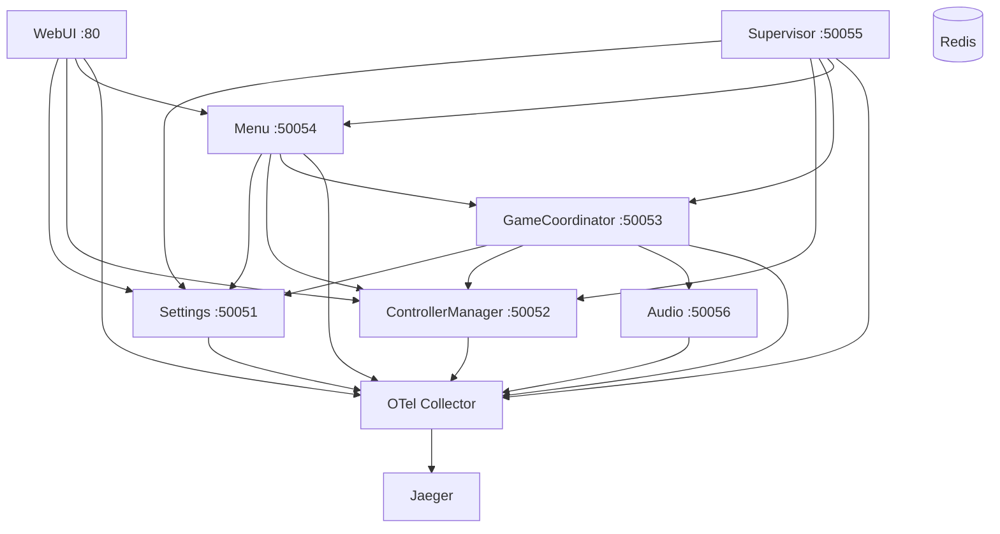

# Phase 11 Implementation Plan - Documentation & Architecture Overview

**Date:** 2026-01-10
**Status:** 📋 Planning
**Goal:** Comprehensive documentation overhaul for cloud-native microservices architecture

---

## Context

Current README.md describes legacy monolithic Pi setup. Need to completely rewrite documentation to reflect:
- 7 microservices architecture (Settings, ControllerManager, GameCoordinator, Menu, Supervisor, WebUI, Audio)
- gRPC communication (not Queue-based IPC)
- Docker Compose deployment (not direct Pi execution)
- OpenTelemetry observability
- Cloud-native patterns

---

## Scope

Phase 11 focuses on **essential documentation** for developers and users:

### Priority 1: Core Documentation (This Phase)
1. ✅ Main README.md rewrite
2. ✅ docs/ARCHITECTURE.md
3. ✅ docs/DEVELOPMENT.md
4. ✅ Service READMEs for all 7 microservices
5. ✅ Key Mermaid diagrams

### Priority 2: Extended Documentation (Future)
- docs/DEPLOYMENT.md (Kubernetes, production)
- docs/API.md (comprehensive gRPC API reference)
- docs/OBSERVABILITY.md (deep dive on OTel/Jaeger)
- docs/MIGRATION.md (migrating from legacy)
- CHANGELOG.md
- Additional Mermaid diagrams

**Decision:** Focus on Priority 1 for Phase 11. Priority 2 can be Phase 11b or later.

---

## Implementation Tasks

### Task 1: Create docs/ Directory Structure

**Create directories:**
```bash
mkdir -p docs
mkdir -p docs/diagrams
mkdir -p docs/examples
```

**Commit:** `feat: Create docs directory structure for Phase 11`

---

### Task 2: Create Core Architecture Documentation

**File:** `docs/ARCHITECTURE.md`

**Content:**
- Project overview (cloud-native JoustMania)
- Microservices architecture diagram (Mermaid)
- Service descriptions (all 7 services)
- Communication patterns (gRPC, streaming)
- Data flow diagrams
- Technology stack
- Design decisions

**Mermaid Diagrams to include:**
1. High-level microservices architecture
2. Service dependency graph
3. gRPC communication flow

**Commit:** `docs: Add ARCHITECTURE.md with microservices overview`

---

### Task 3: Create Development Guide

**File:** `docs/DEVELOPMENT.md`

**Content:**
- Prerequisites (Docker, Python, etc.)
- Quick start guide
- Building services
- Running services locally
- Testing with grpcurl
- Viewing traces in Jaeger
- Hot reloading / development workflow
- Code organization
- Adding new services
- Debugging tips

**Mermaid Diagrams to include:**
1. Development workflow
2. Testing workflow

**Commit:** `docs: Add DEVELOPMENT.md with developer guide`

---

### Task 4: Rewrite Main README.md

**Current:** Legacy monolithic Pi setup instructions
**Target:** Modern cloud-native project README

**Structure:**
1. **Project Description**
   - Cloud-native microservices architecture
   - PS Move controllers + motion gaming
   - OpenTelemetry observability demo

2. **Features**
   - 7 microservices
   - gRPC communication
   - Real-time controller streaming
   - Distributed tracing
   - Multiple game modes

3. **Architecture Overview**
   - High-level diagram (Mermaid)
   - Brief service descriptions
   - Link to docs/ARCHITECTURE.md

4. **Quick Start**
   - Docker Compose deployment
   - Access URLs (Jaeger, Web UI)
   - Basic usage

5. **Hardware Requirements**
   - PS Move controllers
   - Bluetooth adapter
   - Raspberry Pi (or Linux)

6. **Game Modes**
   - Keep existing game rules
   - Brief description of supported modes

7. **Development**
   - Link to docs/DEVELOPMENT.md
   - Contributing guidelines

8. **Observability**
   - Jaeger traces
   - Prometheus metrics
   - Link to docs/ for details

9. **Project History**
   - Credit original JoustMania
   - Explain refactoring purpose

10. **License & Credits**

**Commit:** `docs: Rewrite main README.md for cloud-native architecture`

---

### Task 5: Create Service READMEs

Create README.md for each of the 7 microservices:

#### 5a. services/settings/README.md
- Purpose: Centralized settings management
- gRPC API: GetSettings, UpdateSetting, SubscribeToChanges
- Schema validation
- Example grpcurl calls
- Configuration

#### 5b. services/controller_manager/README.md
- Purpose: PS Move controller I/O and lifecycle
- Hardware dependencies
- gRPC API: GetControllers, StreamControllerStates, PairController
- Mock mode vs hardware mode
- Example grpcurl calls

#### 5c. services/game_coordinator/README.md
- Purpose: Game lifecycle management
- Game state machine diagram
- gRPC API: StartGame, GetGameStatus, StreamGameEvents
- Supported game modes (13)
- Example grpcurl calls

#### 5d. services/menu/README.md
- Purpose: Menu UI and navigation
- Menu state machine
- gRPC API: StartMenu, ProcessInput, StreamMenuEvents
- Input handling
- Example grpcurl calls

#### 5e. services/supervisor/README.md
- Purpose: Service health monitoring
- Health check mechanism
- gRPC API: GetProcessStatus, RestartProcess, StreamProcessUpdates
- Monitored services
- Example grpcurl calls

#### 5f. services/webui/README.md
- Purpose: Web interface
- Flask routes
- gRPC client connections
- Features (settings, battery, monitoring)
- Accessing the UI

#### 5g. services/audio/README.md
- Purpose: Audio playback and mixing
- Priority-based sound mixing
- gRPC API: PlaySound, PlayMusic, ChangeTempo
- Audio configuration
- Example grpcurl calls

**Commit (per service):** `docs: Add README for <service> microservice`

---

### Task 6: Add Key Mermaid Diagrams

Create essential diagrams:

1. **Microservices Architecture** (in ARCHITECTURE.md)


2. **Service Dependency Graph**
3. **gRPC Communication Flow**
4. **Game Lifecycle State Machine**
5. **Menu State Machine**

**Commit:** `docs: Add Mermaid diagrams for architecture visualization`

---

### Task 7: Create Phase 11 Completion Document

**File:** `PHASE_11_COMPLETED.md`

Document:
- All completed tasks
- Before/after comparison
- Documentation coverage
- Links to all new docs
- Verification checklist

**Commit:** `docs: Add Phase 11 completion summary`

---

## Success Criteria

- ✅ Main README.md reflects cloud-native architecture
- ✅ docs/ARCHITECTURE.md provides comprehensive overview
- ✅ docs/DEVELOPMENT.md enables new developers to contribute
- ✅ All 7 services have README.md with API documentation
- ✅ Key Mermaid diagrams visualize architecture
- ✅ grpcurl examples for all services
- ✅ Documentation is accurate and up-to-date
- ✅ Legacy information removed or marked as legacy

---

## Metrics

### Before Phase 11
- README.md: Legacy monolithic setup
- Service docs: None
- Architecture docs: Implementation notes only
- Diagrams: None
- Developer guide: None

### After Phase 11
- README.md: Modern cloud-native project
- Service docs: 7 comprehensive READMEs
- Architecture docs: ARCHITECTURE.md, DEVELOPMENT.md
- Diagrams: 5+ Mermaid diagrams
- Developer guide: Complete onboarding path

---

## Git Commits

Planned commits (8-10):
1. Create docs directory structure
2. Add ARCHITECTURE.md
3. Add DEVELOPMENT.md
4. Rewrite main README.md
5-11. Add README for each service (7 commits)
12. Add Mermaid diagrams
13. Phase 11 completion summary

**Total:** ~13 commits

---

## Out of Scope (Future Phases)

These are valuable but not critical for Phase 11:
- docs/DEPLOYMENT.md (Kubernetes deployment)
- docs/API.md (exhaustive API reference)
- docs/OBSERVABILITY.md (OTel deep dive)
- docs/MIGRATION.md (legacy migration guide)
- CHANGELOG.md
- Protobuf inline documentation
- Additional Mermaid diagrams
- API examples directory

**Reason:** Phase 11 focuses on core documentation that unblocks developers immediately. Extended documentation can be added incrementally.

---

## Risks & Mitigations

**Risk 1:** Documentation gets stale quickly
- **Mitigation:** Focus on architecture and concepts, not implementation details

**Risk 2:** Too much documentation to maintain
- **Mitigation:** Limit scope to essentials for Phase 11

**Risk 3:** Diagrams become outdated
- **Mitigation:** Use Mermaid (text-based, easy to update)

**Risk 4:** README too long
- **Mitigation:** Link to docs/ for detailed information

---

## Next Steps After Phase 11

- Phase 12: Dependency updates (Jaeger v2, Python 3.12, etc.)
- Phase 13: Game modes refactoring (gRPC-based)
- Phase 11b (optional): Extended documentation (DEPLOYMENT, API, OBSERVABILITY, MIGRATION)
