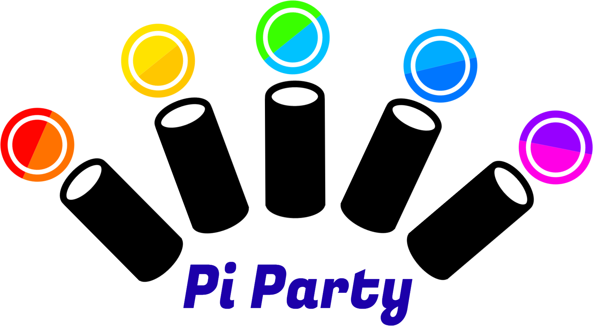

Party games for the Pi!
--------------------------------------

* PiParty is a collection of playstation move enabled party games specifically designed for the raspberry pi
* [Johann Sebastian Joust](http://www.jsjoust.com/) Started the movement game phenomenon, This collection of games attempts to expand upon the basic joust gameplay with new modes, as well as entirely new games. 
* PiParty has currently been tested on 16 move controllers successfully, with more modes and games coming soon!

Awesome Features!!
--------------------------------------

* 16+ Players simultaneous support! yup you heard that right, massive Joust battles
* Super easy setup
* Multi game support, go beyond the standard Joust game, with team battles, werewolf, zombies, and commander mode
* custom music support, play with your own music
* convention mode, no manual instructions needed, the game plays itself and switches between game modes.

Hardware
---------------------------
You will need the following to run PI party:

0. A raspberry pi 2 B+
0. Micro SD card for the raspberry pi
0. Up to 3, Class 1, Bluetooth 4.0 usb adapters (each adapter can handle 6-7 move controllers)
0. External USB sound card
0. External battery (the larger the better)
0. Speaker, preferably portable
0. As many playstation move controllers as you can handle

Installation
---------------------------

0. [Download](https://www.raspberrypi.org/downloads/raspbian/) and [Install](https://www.raspberrypi.org/documentation/installation/installing-images/README.md) Raspbian on the micro SD card
0. Connect your bluetooth adapters, external USB Soundcard, ethernet, keyboard, mouse and hdmi output
0. Power up the Pi and wait for the boot menu on screen
0. Select to expand the Filesystem (option 1) and Boot to Desktop as a pi user (option 3), then hit finish and reboot.
0. Open a Terminal located at the top of the desktop (the black monitor icon) and run these commands, and you're done!!
```
git clone https://github.com/aangert/PiParty.git
cd PiParty
sudo ./setup.sh
```

Pairing controllers
---------------------------

* once you have installed PiParty, in order to pair controllers, plug them into the raspberry pi via usb, and wait until the bulb turns white. 
* This process should only need to be done once, after this the controller should be permenently paired and will only need to be turned on via the circular sync button on the front of the move controller for any future games
* if the controller does not turn white, this means that the process probably crashed due to a kernal bug with the psmoveapi, restart the the pi and then plug in and retry with the remaining controllers

Games (More coming soon!)
---------------------------------
* In order to change between games, on any controller press the select button (located on the left side)
* The colors of the controllers show which game is selected, for example, for FFA, all controllers will be white
* Press start (located on the right side) on any controller to launch the selected game, a countdown until the game starts will begin!

Joust
---------------------------------
* Based off of the original [JS Joust](http://www.jsjoust.com/)
* The aim of the game is to force all the other players to move their controllers too fast, either by hitting the controller, making them flinch, or anything else you can think of
* The sensitivity of the controllers is tied to the music, when the music speeds up, you are able to move faster
* If your controller is going too fast it will flicker and vibrate as a warning.
* If you are knocked out, your controller goes dark and vibrates.
* The last player standing has their controller flash a beautiful rainbow sequence, and all controllers vibrate to indicate the end of the game.

 FFA (all controllers are white)
 ---------------------------------
 * The most basic version of Joust, Be the last one standing!

 Teams (all controllers are solid colors)
 ---------------------------------
 * This game is the same as Joust FFA however at the beginning players select their team color with the big button in the middle of their controller
 * There are six teams to select from

 Random Teams (all controllers changing colors)
 ---------------------------------
 * Same as Joust Teams, however the teams are randomly assigned at start of play
 * There are three teams in this mode

 WereJoust (one controller red, the rest white)
 ---------------------------------
 * Same as Joust Teams, although there is one hidden "Werewolf" on one of the teams
 * When the countdown starts the werewolf will feel a vibration, letting that player know they are the Werewolf
 * The Werewolf is on their own team, and will win only if they are the last player remaining
 * There are two regular teams in this mode

Zombie apocalypse (Coming Soon!)
---------------------------------
Prepare to be spooked!!

