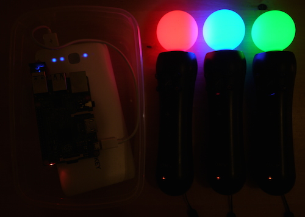

Oust
====
<sup>Also known as Candle Fight, Jonty Sebastian Joust, and "that game with the lights".</sup>

A love letter to [Johann Sebastian Joust](http://www.jsjoust.com/), designed for playing outdoors at festivals in the dark. All night long (all night).




A long time ago on a boat far far away
--------------------------------------
When organising [Electromagnetic Wave](https://www.emfcamp.org/wave) in early 2013 we asked some of the [Wild Rumpus](http://thewildrumpus.co.uk/) organisers to run evening games on the boat. A very beta version of Joust was run on the deck to rave reviews.

Fast forward to 2015. We've taken Joust (in both beta and final versions) to [OHM](https://en.wikipedia.org/wiki/Observe._Hack._Make.) in 2013, [EMF](https://www.emfcamp.org) in 2014, and [CCC](https://events.ccc.de/camp/2015/wiki/Main_Page) in 2015. Every time the game runs all night with almost no supervision.

By this point the game has developed a bit of a following and people are actively seeking us out to play. But there are problems. Joust requires a laptop to run (meaning we need to be near a power supply and can't leave it alone), it needs speakers for the music (which we never have), and people have trouble understanding the gameplay without announcements and cues.

I went to CCC prepared. We had 11 move controllers, three Raspberry Pi's, 46 Ah of portable batteries, and more bluetooth adapters than there are bluetooth channels.

Oust is the result. It runs on a Raspberry Pi 2, can run up to 8 or more controllers, and is specifically designed for environments so loud sign language is required.

It was playtested and tweaked extensively at CCC - at one point with a circle of approximately 150 people playing & watching. The longest game I recorded finished after 9 hours of continuous play.

How to Oust
-----------
1. Turn the Raspberry Pi on.
2. Turn the controllers on.
3. Play!

No really how does one Oust
---------------------------
The game is designed to run on a Raspberry Pi hooked up to a honking great battery pack. There is no interface other than the controllers themselves.

If you were starting out from scratch this is what it would look like:

1. Install Oust on the Raspberry Pi, including the nasty bluetooth hacks (See below).
2. Plug the Pi into your battery pack.
3. Connect each controller to the Pi in turn using a MiniUSB cable. When the controller goes white it has been paired.
4. Turn on as many controllers as you want to play with.
5. Each player presses the trigger, and the game begins.
6. Optionally put the Pi & battery in a plastic sandwich box.

But what does the game look like?
---------------------------------
1. All the controllers are dark. As the players press the squishy trigger their controller lights up white.
2. When all the controllers are white (or someone presses Triangle) the controllers will vibrate, then flash red/yellow/green as a "get ready" signal.
3. Every controller turns a different colour and the game has begun.
4. The aim of the game is to force all the other players to move their controllers too fast, either by hitting the controller, making them flinch, or the other player doing something stupid.
5. If your controller is going too fast it'll flicker as a warning.
6. If you are knocked out, your controller goes dark and vibrates.
7. The last player standing has their controller flash a beautiful rainbow sequence, and all controllers vibrate to indicate the end of the game.
8. The game resets, people hand their controllers to other people to play. GOTO 1.

Amazing Features
----------------
* Instant setup
* Easy pairing
* Add/remove controllers to the game on the fly
* Battery checking button (Press circle)
* Secret goddamn-it-start-the-game button (Press Triangle)
* "Ready, Steady, Go" start sequence to get players attention
* Going-too-fast warning
* Music Slowdown/Speedup effects, with changing sensitivity!!
* Support for as many controllers as bluetooth interference will allow
* Mostly doesn't crash, but when it does it's a kernel panic and not my fault

How to install Oust
-------------------
1. Buy Hardware: Raspberry Pi 2, Class 1 Bluetooth USB adapter(s), USB sound card
2. Install Raspbian on the SD card
3. Checkout PSMoveAPI to the pi user's home directory (https://github.com/thp/psmoveapi)
4. Merge in this patch to fix compilation on the Rpi https://github.com/thp/psmoveapi/pull/184
5. `apt-get install swig python-dev bluez`
6. Build PSMoveAPI standalone (5.b here https://github.com/thp/psmoveapi/blob/master/README.ubuntu)
7. Copy [oust.py](oust.py) , [oustpair.py](oustpair.py) , [oustaudioblock.py](oustaudioblock.py) and the audio folder to /home/pi/psmoveapi/build/
8. `apt-get install supervisor`
9. Replace /etc/supervisor with the contents of [supervisor](supervisor)
10. Copy [scan_enable.sh](scan_enable.sh) to /home/pi/
11. Reboot the pi and pair your controllers!

Getting Audio to work
---------------------
* Audio can be a laborious process to get working, pyaudio does not seem to work with the built in sound card so an external USB one is necessary. 
* You will need to enable the sound card as default as well, some things that I have tried is in /etc/modprobe.d/alsa-base.conf modify and add the following lines and reboot:
```
# Keep snd-usb-audio from beeing loaded as first soundcard
options snd-usb-audio index=0
options snd-bcm2835 index=1
```

* if this doesn't work in /etc/modules comment out this line:
```
#snd-bcm2835
```
* remove the sound icon from taskbar at the top, and reboot, otherwise the taskbar won't load properly

Pairing controllers
-------------------
* recently I have had little problems with pairing controllers, Once they are initially paired up, they should automatically sync up, if they do not you may want to try modifying line 92 in /usr/bin/bluez-simple-agent to
```
capability = "DisplayYesNo"
```
* Pairing controllers should work with multiple bluetooth adapters, Each one can handle up to 7 connections, the oustpair.py connects ps move controllers equally amongst the currently connected adaptors(i.e. in an 8 player game it will be a 4/4 split amongst both adapters). I have tried with 8 controllers currently and it has seemed to work well, I'll do some more testing in the future.
* If you need to reset the Bluetooth connections and pair again run the reset_bluetooth_connections_and_reboot.sh script

Extra dependencies
-------------------
* I've spent a while getting the audio slowdown/speed up effects to work, so I don't quite remember all of the steps to install the dependencies needed. both numpy and scikits.samplerate will need to be installed for oust to work. I will soon be going through an entire reinstall of the program to make sure that I can list what needs to be installed here soon. In the mean time you may have to do a bit of searching to install everything.

Things You Should Know
----------------------
* The Playstation Move controllers actually implement the USB 1.2 standard, which means they NEED a data connection to charge. Essentially, you must connect them to a computer to charge them, a wall wart won't do.
* Building PSMoveAPI is horrid. I'll publish debian packages soon.
* The Raspberry Pi has a number of problems. The main one is that the current kernel (or bluez) shipped in Raspbian is broken - as soon as one controller is paired and has an active data link, the bluetooth adapter receives a command telling it to disable connecting to any other devices. Fortunately I was camping with [ms7821](https://twitter.com/marksteward) and [gavan](https://twitter.com/gavanfantom) who are terrifying bluetooth experts and spent a happy afternoon with HCI packet dumps debugging this. [scan_enable.sh](scan_enable.sh) is the hilarious solution they came up with - once a second it pokes all the bluetooth devices and tells them to accept connections again.
* Bluetooth is limited to 7 devices per adapter. We've had Oust running with 8 devices, but pairing 9 causes unacceptable lag across all controllers. Bluetooth is a frequency-hopping protocol with 42 channels, and having that many active devices causes collisions. We are fairly certain we can limit the bluetooth channels in use per adapter to solve this, but that is future research.

Future Things I May Do
----------------------
* A pre-built bootable image for the Raspberry Pi (possibly USB bootable)
* Debian packages of PSMoveAPI for the pi
* A script that does all the install things
