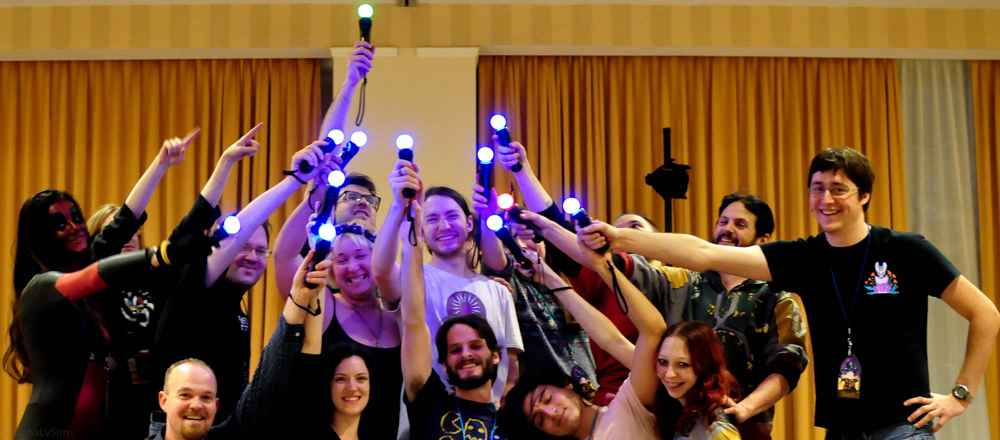
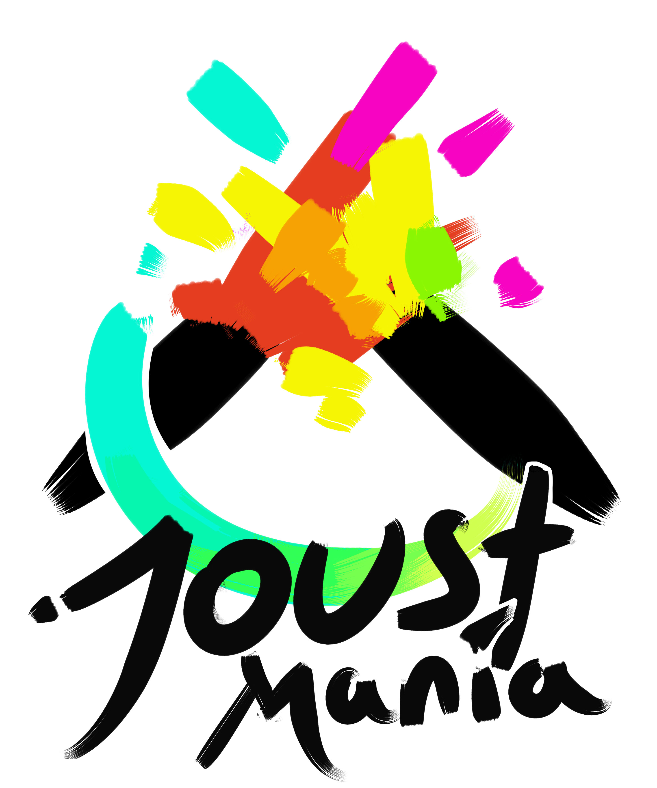

JoustMania at Magfest 2017!

<p align="center">
  
</p>


What is JoustMania????
--------------------------------------

* JoustMania is a collection of PlayStation Move enabled party games based off of the "Jostling" mechanic introduced in [Johann Sebastian Joust](http://www.jsjoust.com/)
* JoustMania includes FFA, Teams, Werewolves, Zombies, Commander modes, and lots of other goodies!
* The system is also designed to be easy to set up at conventions and is made to run itself with a large group of people. In convention mode, every game is started once everyone is ready, and announces the rules aloud for new players to learn.

Cool Stuffs!
--------------------------------------

* 16+ Player support
* Super easy setup
* Runs in Headless mode, no screen required
* Optional web interface, view status and change game settings with your phone
* Custom music support, play with your own music
* Convention mode, no manual instructions needed, the game plays itself and switches between game modes

Hardware
---------------------------
You will need the following to run JoustMania:

* A Raspberry Pi 3 B with sd card

Optional and **highly recommended**:

* Class 1, Bluetooth 4.0 USB adapters (http://a.co/8YKP9tG)

Note on Hardware: The internal bluetooth is short range and has a high latency, making gameplay laggy and slow, although still possible.
The class 1 adapters allow bluetooth connections up to 300+ feet and allow for the gameplay to be smooth, each adapter can connect to 6 to 7 controllers. I've tested this build with three adapters and 16 controllers successfully.

Optional:

* USB hub for charging controllers (http://a.co/7T3HDmJ)

This will allow you to charge 9 controllers at once through the pi

**Note: the new psmove controllers with a micro charging connection will not work with Joustmaina, this issue is being looked at with the psmoveapi(https://github.com/thp/psmoveapi/issues/353)**

For questions on hardware, or if you would like to inquire about purchasing a fully setup Joustmania device, please reach out to joustmaniagame@gmail.com

Installation
---------------------------

0. [Download](https://www.raspberrypi.org/downloads/raspbian/) and [Install](https://www.raspberrypi.org/documentation/installation/installing-images/README.md) Raspbian on the micro SD card, this build was tested on the full version of raspian stretch.
0. Connect the bluetooth adapters and speaker
0. Turn on the pi, open a Terminal and run these commands, the pi will reboot on a successful install
0. If prompted about restarting services select yes
0. If something goes wrong during instillation, try running setup.sh again.

```
git clone https://github.com/adangert/JoustMania.git
cd JoustMania
sudo ./setup.sh
```
If you have the bluetooth adapters, disable the on-board bluetooth 
```
sudo ./disable_internal_bluetooth.sh
```
You can now disconnect the hdmi cable and run JoustMania in headless mode. JoustMania will automatically boot up on restart, menu music should start playing once the pi boots up.

Update Joust Mania
---------------------------
You can update Joust Mania by doing a `git pull` in the main directory and running
```
./setup.sh
```


Pairing controllers
---------------------------

* In order to pair controllers permanently, plug them into the Raspberry Pi via USB
* Once plugged in, the controller should turn white indicating that it has been paired correctly
* Press the PlayStation sync button (the circular one in the middle) to wirelessly connect paired controllers to the Pi

If pairing is not working for some reason, or you would like to resync all controllers run the following
```
sudo -i
cd /home/pi/JoustMania/
./reset_bluetooth_connections.sh
```

How to select a game mode
---------------------------------
* In order to change between games, on any controller press the select button (located on the left side of a controller)
* Changing game types will turn you into an Admin
* In order to remove a controller from play press all four front buttons

How to start a game
---------------------------------
* When a player presses the trigger button their controller will turn white
* Once all controllers are white the game will begin!

Admin Mode (Sensitivity and convention mode settings)
---------------------------------
You can become an Admin by changing the game mode via the select button, this will allow you to modify the games settings from the four front buttons on the controller, After a game is played the Admin mode will be reset

* (Cross) Add or remove a game from Convention mode, your controller will be green if the game is added and Red if it is not, Custom Teams mode can not be added to the Convention mode
* (Circle) Change sensitivity of the game. There are three settings, slow, medium, and fast, you will hear a corresponding sound for each
* (Square) toggle the playback of instructions for each game
* (Triangle) show battery level on all controllers

Web Interface
---------------------------------
Joustmania can also be controlled via a web browser on your laptop or smartphone. If your Pi is on a network, use the IP address of your Pi (for example, http://192.168.1.xxx/). Alternatively, you can turn your Pi in to an access point and connect your device directly to it. To enable this,  run the command
```
sudo ./enable_ap.sh
```
Note that this disables normal Wi-Fi on the Pi, but a wired connection will still work. The default SSID is "JOUSTMANIA" and the default password is "joustmania"; both (and other) settings may be adjusted in the apfiles/hostapd.conf file before running enable_ap.sh. To connect to the game, go to http://joust.mania in your web browser. To disable the access point and restore Wi-Fi, run the command
```
sudo ./disable_ap.sh
```
If Wifi does not come back after issuing this command: go to "/etc/dhcpcd.conf" and open it, look for "#Access point for JoustMania" Change the line below that to "interfaces wlan0" reboot, and your wifi will come back.

Custom Music
---------------------------------
* JoustMania comes with a couple of pre-installed default songs.
* Play your own music, by copying it into the respective folders: /audio/(Joust, Zombie, Commander)/music/
* Supports Mp3, Wav, Ogg, flac and others [Here](http://www.ffmpeg.org/general.html#File-Formats), 
* All music and audio can be disabled by changing `audio = False` in joustconfig.ini, this will also disable tempo sensitivity changes for each game mode


# Game Rules and Variants 
* Keep your controller still while trying to jostle others.
* If your controller is jostled, then you are out of the game!
* The music is tied to the gameplay, the faster the music the faster you can move
* Minimum and recommended player count is listed next to every game mode
* Extended rules can be found on the [Wiki](https://github.com/adangert/JoustMania/wiki/Extended-Rules)

 ### Joust Free-for-All (2+ players)
 * This is the first mode that JoustMania boots to
 * The most basic version of Joust; be the last one standing!


 ### Joust Teams (Minimum 3+ players, 4+ players recommended)
 * This game is the same as Joust Free-for-All however at the beginning players select their team color with the big button in the middle of their controller
 * There are six teams to select from


 ### Joust Random Teams (3+ players)
 * Same as Joust Teams, however the teams are randomly assigned at start of play
 * There are 2-4 teams in this mode, depending on number of players


 ### Traitors (Minimum 6+ players, 9+ players recommended)
 * Two or three teams face off against one another, however there is a traitor on every team
 * Traitors are on an additional secret team
 * If you controller vibrates during the start countdown, you are a traitor!


 ### Werewolves (Minimum 3+ players, 6+ players recommended)
 * Hidden werewolves are selected at the beginning of the game.
 * When the countdown starts the werewolf will feel a vibration, letting that player know they are a werewolf
 * After a short period of time, werewolves will be revealed
 * Werewolves win only if they are the last remaining


 ### Zombies (Minimum 4+ players, 10+ players recommended)
 * Two players start out as zombies, and try to infect the humans
 * Humans can shoot random zombies with bullets
 * Bullets are randomly assigned as loot from killing zombies
 * Humans try to survive for a couple of minutes, otherwise zombies win!
 
 
 ### Commander (Minimum 4+ players, 6+ players recommended)
 * Players are split into two teams
 * One commander is chosen for each side, if this commander dies, the other team wins
 * Commanders can activate special abilities that helps their team win


 ### Swapper (Minimum 3+ players, 4+ players recommended)
 * Players start on two teams
 * When you die, you switch to the other team
 * The last person remaining does not switch
 
 
 ### Fight Club (2+ Players)
 * Two players fight eachother
 * The loser goes to the back of the line
 * The winner gains a point
 * The player with the most points at the end wins.


 ### Tournament (3+ players)
 * Everyone is paired up 1v1 via controller colors
 * If your controller is white, wait to be assigned to a new player
 * The last person remaining wins!
 
 
 ### Non Stop Joust (2+ players)
 * Same as FFA, however when you die you respawn
 * The player that died the least at the end of the 2.5 minute round wins!


 ### Ninja Bomb (2+ players)
 * Players stand in a circle each holding a controller
 * Players press A to join the game. 
 * A bomb is passed around by pressing the A button, if held too long it will explode
 * Players can try to pass a traps in order to fake out their opponents.
 * If a player presses A or trigger while holding a trap, they explode
 * Traps are passed by holding the trigger-button half way, too much or too little and you'll give yourself away
 * Traps can also be countered by pressing any of the four front buttons.
 * Players have two lives, the last player remaining wins!
 
  ### Convention/Random mode

 * This mode allows for multiple game types to be randomly rotated with instructions played before each game
 * Random mode defaults to FFA, Random Teams, Werewolves, and Swapper, more game modes can be added or removed as an Admin or via the web interface (see above)
 * Modes with an insufficient number of players will be ignored, if none are available Joust Free-for-All is selected
