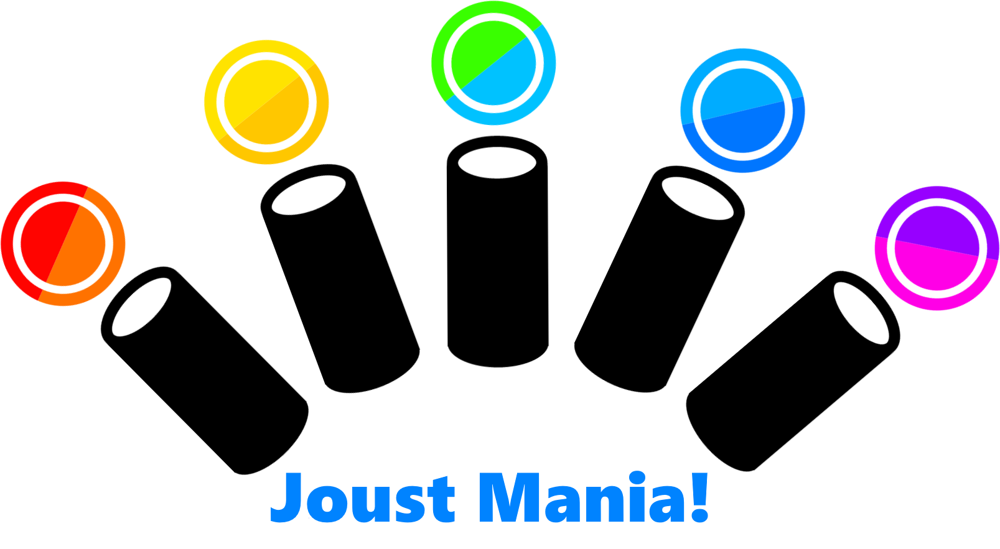

JoustMania at Magfest 2017!


JS Joust for the Pi!
--------------------------------------

* JoustMania is a collection of PlayStation Move enabled party games specifically designed for the Raspberry Pi
* [Johann Sebastian Joust](http://www.jsjoust.com/) Started the movement game phenomenon, this collection of games attempts to expand upon the basic joust gameplay with new modes, as well as entirely new games

Awesome Features!!
--------------------------------------

* 16+ Players simultaneous support! yup you heard that right, massive Joust battles
* Super easy setup
* Multi game support, go beyond the standard Joust game, with team battles, werewolf, zombies, and commander mode
* Custom music support, play with your own music
* Convention mode, no manual instructions needed, the game plays itself and switches between game modes

Hardware
---------------------------
You will need the following to run JoustMania:

0. A Raspberry Pi 3 B
0. Micro SD card for the Raspberry Pi
0. Up to 3, Class 1, Bluetooth 4.0 USB adapters (each adapter can handle 6-7 move controllers)
0. External USB sound card
0. Power supply (the Pi will run off of a battery pack)
0. Speaker
0. As many PlayStation Move controllers as you can handle

Installation
---------------------------

0. [Download](https://www.raspberrypi.org/downloads/raspbian/) and [Install](https://www.raspberrypi.org/documentation/installation/installing-images/README.md) Raspbian on the micro SD card (tested with Jessie 2016-09-23 release)
0. Connect your bluetooth adapters, external USB Soundcard, keyboard, mouse and hdmi output
0. Power up the Pi
0. connect to the internet (wifi or ethernet)
0. Open a Terminal located at the top of the desktop (the black monitor icon), run these commands, and you're done!!
```
git clone https://github.com/adangert/JoustMania.git
cd JoustMania
sudo ./setup.sh
```

Pairing controllers
---------------------------

* Once you have installed JoustMania, in order to pair controllers, plug them into the Raspberry Pi via USB
* After a controller has been synced via USB, press the PlayStation sync button (the circular one in the middle) to connect the controller to the Pi
* This process should only need to be done once, after this the controller should be permenently paired with the Pi and will only need to be turned on via the sync button for any future games
* All the controllers may restart when pairing, this is expected, just keep plugging in new ones until they are all paired. if you encounter problems restart the Pi, and continue pairing the remaining controllers, again once this process is finished you should not have to connect the controllers to the Pi again via USB

How to select a game mode
---------------------------------
* In order to change between games, on any controller press the select button (located on the left side)
* The colors of the controllers show which game is selected, for example, for FFA, all controllers will be white
* Press start (located on the right side) on any controller to launch the selected game, a countdown until the game starts will begin!
* In order to remove a controller from play press all four front buttons

Custom Music
---------------------------------
* JoustMania comes with a single classical music piece
* Play your own music, by copying it into the respective folders: /audio/(Joust, Zombie, Commander)/music/
* WAV files currently supported

Joust
---------------------------------
* Based off of the original [JS Joust](http://www.jsjoust.com/)
* The aim of the game is to force all the other players to move their controllers too fast, either by hitting the controller, making them flinch, or anything else you can think of
* The sensitivity of the controllers is tied to the music, when the music speeds up, you are able to move faster
* If your controller is going too fast it will flicker and vibrate as a warning
* If you are knocked out, your controller goes dark and vibrates
* The last player standing has their controller flash a beautiful rainbow sequence, and all controllers vibrate to indicate the end of the game


 FFA (all controllers are white)
 ---------------------------------
 * The most basic version of Joust; be the last one standing!

 Teams (all controllers are solid colors)
 ---------------------------------
 * This game is the same as Joust FFA however at the beginning players select their team color with the big button in the middle of their controller
 * There are six teams to select from

 Random Teams (all controllers changing colors)
 ---------------------------------
 * Same as Joust Teams, however the teams are randomly assigned at start of play
 * There are three teams in this mode

 Werewolfs (one controller red, the rest white)
 ---------------------------------
 * Hidden werewolfs are selected at the beginning of the game.
 * When the countdown starts the werewolf will feel a vibration, letting that player know they are a werewolf
 * After a short period of time, werewolfs will be revealed
 * The Werewolfs only if they are the last remaining

 Zombie apocalypse
 ---------------------------------
 * Two players start out as zombies, and try to infect the humans
 * Humans can shoot random zombies with bullets
 * Bullets are randomly assigned as loot from killing zombies
 * Humans try to survive for a couple of minutes, otherwise zombies win!
 
 Commander
 ---------------------------------
 * Teams are split into two sides
 * One commander is chosen for each side, if this commander dies, the other team wins
 * Commanders can activate special abilities that helps their team win
 
  Random mode (for conventions)
  ---------------------------------
  * All players press the A button (middle of controller) to signal they are ready to play
  * Once all players are in a random game mode (excluding commander) will be selected
  * Instructions for the game mode will play and the game will begin
 
  Swaper (coming soon)
  ---------------------------------
  * Players start on two teams
  * When you die, you switch to the other team
  
  Ninja Bomb (coming very soon)
  ---------------------------------
  * players sit in a circle each holding a controller
  * a bomb is passed around, if held too long it will explode
  * players can try to pass a fake bombs in order to make their opponents explode.
  * last player remaining wins!
