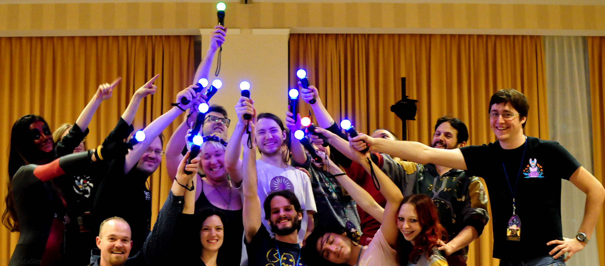

# JoustMania - Cloud-Native Edition

**Microservices-based Motion Gaming Platform for PlayStation Move Controllers**

---

## Overview

JoustMania is a collection of PlayStation Move-enabled party games based on the "jostling" mechanic. This is a **cloud-native refactor** of the [original JoustMania project](https://github.com/adangert/JoustMania), rebuilt as a microservices architecture with modern observability practices.

### What's New in This Fork

This version focuses on:
- ✅ **Microservices Architecture** - 7 independent services communicating via gRPC
- ✅ **Cloud-Native Deployment** - Docker Compose (development) and Kubernetes-ready
- ✅ **Distributed Tracing** - OpenTelemetry instrumentation with Jaeger visualization
- ✅ **Modern Development** - Protocol Buffers, streaming RPCs, containerization
- ✅ **Production-Ready Patterns** - Health checks, graceful shutdown, structured logging

**Use Case:** This fork serves as an **observability demonstration** and **reference architecture** for cloud-native Python microservices. It's ideal for learning distributed systems, gRPC, and OpenTelemetry.

---

## Features

### Game Modes

- **Joust FFA** - Free-for-all elimination
- **Joust Teams** - Team-based combat
- **Joust Random Teams** - Randomized teams
- **Traitor** - Hidden traitor mechanic
- **Swapper** - Dynamic team switching
- **Fight Club** - 1v1 bracket tournament
- **Tournament** - Elimination brackets
- **Werewolf** - Social deduction
- **Zombies** - Infection survival
- **Commander** - Leader-based teams
- **Non-Stop Joust** - Respawn-enabled combat
- **Ninja/Speed Bomb** - Bomb-passing mechanics

### Technical Features

- Real-time controller state streaming (1000Hz hardware polling → 60Hz gRPC stream)
- Priority-based audio mixing
- Distributed tracing across all services
- Web UI for game control and monitoring
- Service health monitoring
- Configurable game settings with validation

---

## Architecture

```
┌─────────────┐     ┌──────────────────┐     ┌─────────────────┐
│   Web UI    │────▶│  Application     │────▶│  Infrastructure │
│   :80       │     │  Services        │     │  Services       │
└─────────────┘     └──────────────────┘     └─────────────────┘
                            │                         │
                    ┌───────┴────────┐       ┌────────┴────────┐
                    │                │       │                 │
              ┌─────▼─────┐    ┌────▼────┐  │  ┌──────────┐  │
              │   Menu    │    │  Game   │  │  │ Settings │  │
              │  :50054   │    │  Coord  │  │  │  :50051  │  │
              └───────────┘    │ :50053  │  │  └──────────┘  │
                               └─────────┘  │                 │
                                            │  ┌──────────┐  │
                                            │  │Controller│  │
                                            │  │ Manager  │  │
                                            │  │  :50052  │  │
                                            │  └──────────┘  │
                                            └─────────────────┘
                                                     │
                                         ┌───────────▼────────────┐
                                         │  Observability Stack   │
                                         │  ┌──────────────────┐  │
                                         │  │ Jaeger UI :16686 │  │
                                         │  │ OTel Collector   │  │
                                         │  │ Prometheus :8888 │  │
                                         │  └──────────────────┘  │
                                         └────────────────────────┘
```

**For detailed architecture:** See [docs/ARCHITECTURE.md](docs/ARCHITECTURE.md)

---

## Quick Start

### Prerequisites

- Docker (20.10+)
- Docker Compose (v2.0+)
- Optional: PS Move controllers for hardware testing

### 1. Clone & Build

```bash
git clone <repository-url>
cd JoustMania

# Build all services
scripts/docker/build.sh
```

### 2. Start the Stack

```bash
# Start all services
scripts/docker/start.sh
```

This starts:
- 7 microservices (Settings, ControllerManager, GameCoordinator, Menu, Supervisor, WebUI, Audio)
- Jaeger (distributed tracing)
- OpenTelemetry Collector
- Redis
- Prometheus metrics

### 3. Access Interfaces

| Interface | URL | Purpose |
|-----------|-----|---------|
| **Web UI** | http://localhost:80 | Game control interface |
| **Jaeger** | http://localhost:16686 | Distributed traces |
| **Prometheus** | http://localhost:8888/metrics | Metrics endpoint |

### 4. View Logs

```bash
# All services
scripts/docker/logs.sh

# Specific service
scripts/docker/logs.sh settings
```

### 5. Test gRPC APIs

```bash
# Install grpcurl
brew install grpcurl  # macOS
sudo apt-get install grpcurl  # Linux

# List services
grpcurl -plaintext localhost:50051 list

# Call RPC
grpcurl -plaintext -d '{}' localhost:50051 joustmania.SettingsService/GetSettings
```

### 6. View Traces

1. Open http://localhost:16686
2. Select service: `joustmania-settings`
3. Click "Find Traces"
4. Explore distributed traces across services

---

## Hardware Setup (Optional)

For full hardware testing with PS Move controllers:

### Requirements

- PS Move controllers (1-18 supported)
- USB Bluetooth adapter (Class 1 recommended)
- Raspberry Pi or Linux machine

### Setup

```bash
# Run setup script (on Raspberry Pi)
./setup.sh

# Or manually:
scripts/setup/setup_host.sh       # Install dependencies
scripts/setup/build_psmoveapi.sh  # Build PS Move API
```

### Hardware Notes

- **ControllerManager** service requires privileged container for USB/Bluetooth access
- **Audio** service requires privileged container for `/dev/snd` access
- Mock mode available when hardware unavailable (automatic fallback)

---

## Development

### Building Services

```bash
# Rebuild specific service
docker-compose build settings

# Rebuild all
docker-compose build --parallel
```

### Running Tests

```bash
# Unit tests
scripts/testing/run_tests.sh

# Integration tests
pytest testing/test_settings_integration.py
```

### Adding New Features

See [docs/DEVELOPMENT.md](docs/DEVELOPMENT.md) for:
- Development workflow
- Adding new services
- Testing strategies
- Debugging techniques
- Code organization

---

## Documentation

| Document | Description |
|----------|-------------|
| [ARCHITECTURE.md](docs/ARCHITECTURE.md) | Complete architecture overview, design decisions, technology stack |
| [DEVELOPMENT.md](docs/DEVELOPMENT.md) | Developer guide, testing, debugging, best practices |
| [scripts/README.md](scripts/README.md) | Helper scripts documentation |
| Service READMEs | See `services/*/README.md` for each microservice |

---

## Microservices

| Service | Port | Purpose | Privileges |
|---------|------|---------|------------|
| **Settings** | 50051 | Centralized settings management | None |
| **ControllerManager** | 50052 | PS Move I/O and pairing | Privileged (USB, Bluetooth) |
| **GameCoordinator** | 50053 | Game lifecycle management | None |
| **Menu** | 50054 | Menu UI and navigation | None |
| **Supervisor** | 50055 | Service health monitoring | None |
| **WebUI** | 80 | HTTP web interface | None |
| **Audio** | 50056 | Audio playback and mixing | Privileged (audio device) |

---

## Technology Stack

- **Language:** Python 3.11
- **RPC:** gRPC with Protocol Buffers
- **Observability:** OpenTelemetry, Jaeger, Prometheus
- **Containerization:** Docker, Docker Compose
- **Web:** Flask
- **Audio:** pygame.mixer
- **Hardware:** PS Move API, BlueZ

---

## Project History

This project is a fork of the [original JoustMania](https://github.com/adangert/JoustMania) by Adam Engert, which pioneered PlayStation Move party gaming.

### Original JoustMania (2015-present)

- Created for conventions and parties
- Monolithic Python application
- Direct hardware access on Raspberry Pi
- 18+ player support
- [Steam release](https://store.steampowered.com/app/1093850/JoustMania/)

### Cloud-Native Refactor (2026)

- **Purpose:** Demonstrate modern cloud-native patterns and observability
- **Focus:** Microservices architecture, distributed tracing, container orchestration
- **Use Case:** Learning platform for gRPC, OpenTelemetry, and distributed systems
- **Status:** Active development - Phases 9-11 complete (architecture cleanup, documentation)

**Credit:** All game mechanics and original design by Adam Engert. This fork focuses on infrastructure and observability.

---

## Roadmap

### Completed (Phases 1-11)

- ✅ State-based controller architecture
- ✅ 7 microservices with gRPC
- ✅ OpenTelemetry instrumentation
- ✅ Docker Compose deployment
- ✅ Architecture cleanup (Phases 9-10)
- ✅ Comprehensive documentation (Phase 11)

### In Progress

- 🔄 **Phase 12:** Dependency updates (Jaeger v2, Python 3.12)
- 🔄 **Phase 13:** Game modes refactoring (gRPC-based)

### Future

- Kubernetes deployment (Helm charts)
- Advanced observability (custom metrics, dashboards)
- Multi-game support (concurrent games)
- Replay system
- Authentication & authorization

---

## Contributing

Contributions welcome! See [docs/DEVELOPMENT.md](docs/DEVELOPMENT.md) for:
- Setting up development environment
- Code organization
- Testing guidelines
- Submitting pull requests

---

## License

See [LICENSE](LICENSE) file for details.

**Original JoustMania:** Copyright Adam Engert
**Cloud-Native Refactor:** Educational and demonstration purposes

---

## Links

- **Original JoustMania:** https://github.com/adangert/JoustMania
- **Steam Release:** https://store.steampowered.com/app/1093850/JoustMania/
- **Issues:** https://github.com/<your-repo>/issues
- **Discussions:** https://github.com/<your-repo>/discussions

---

## Acknowledgments

- **Adam Engert** - Original JoustMania creator and game design
- **PS Move API Community** - Open-source controller library
- **OpenTelemetry Project** - Observability standards and tooling

---

## Screenshots

### Web UI


### Jaeger Distributed Tracing
_Visualize request flows across microservices_

### Game in Action

_Original JoustMania at Magfest 2017_

---

**Made with ❤️ for learning cloud-native architecture**
