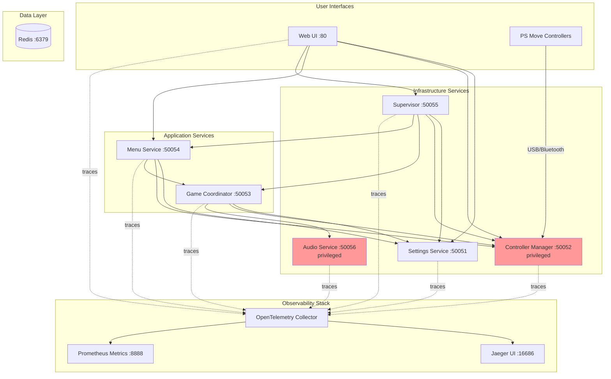
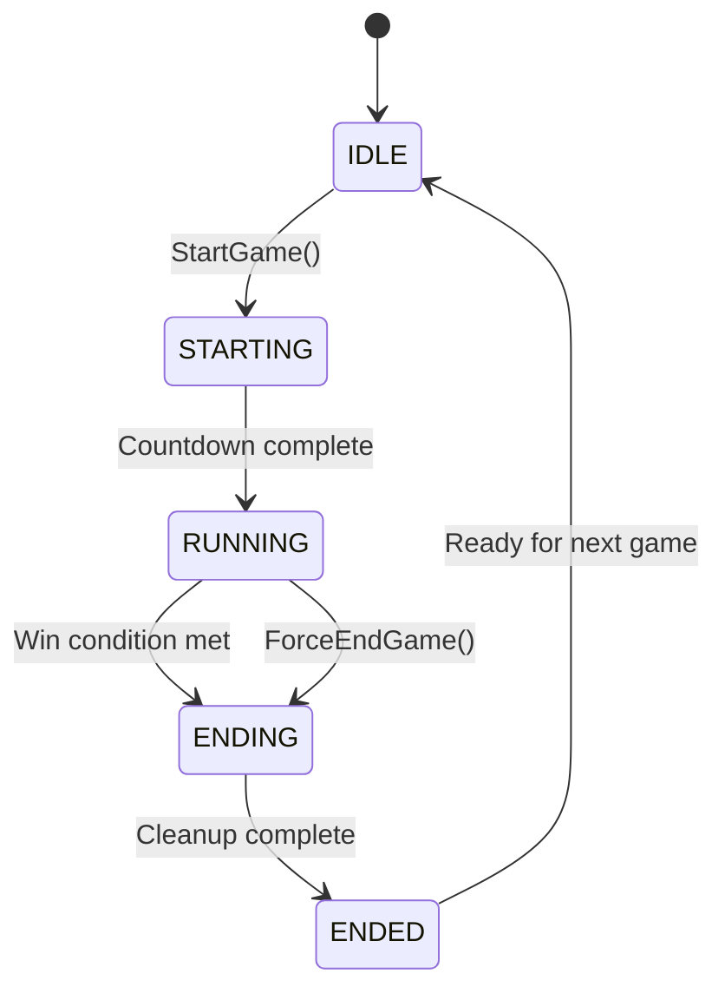
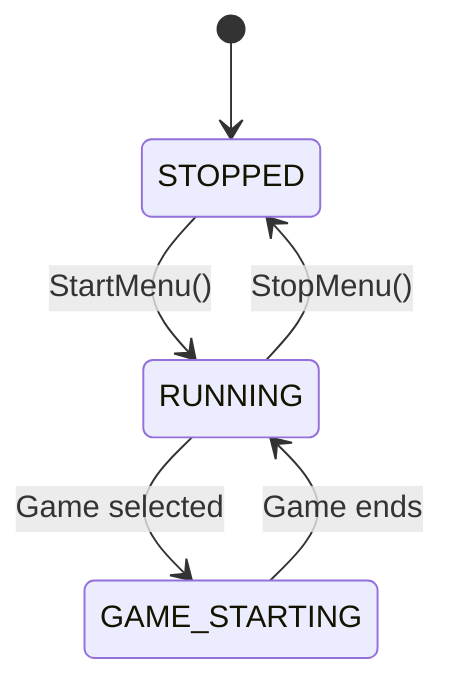
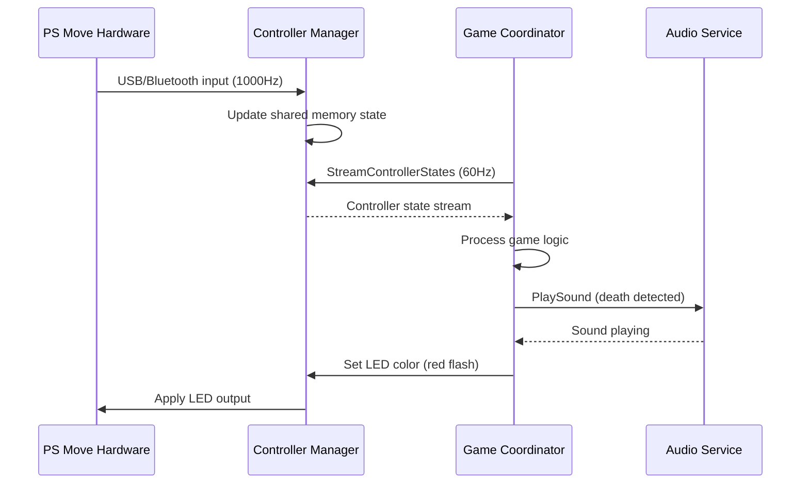
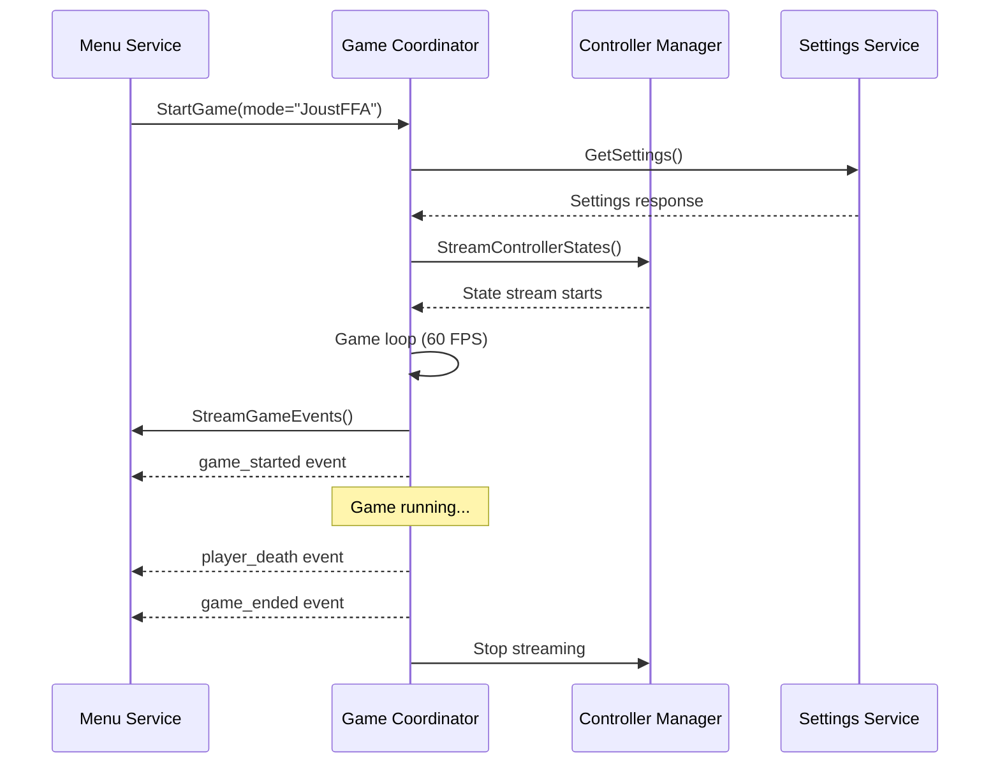
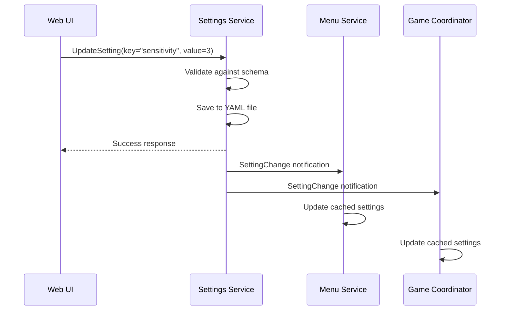

# JoustMania Architecture

**Cloud-Native Microservices Architecture for PS Move Motion Gaming**

---

## Overview

JoustMania is a cloud-native microservices-based motion gaming platform for PlayStation Move controllers. This document describes the architecture, design decisions, and communication patterns of the refactored system.

### Key Characteristics

- **Microservices:** 7 independent services with clear boundaries
- **Communication:** gRPC with Protocol Buffers for inter-service communication
- **Observability:** OpenTelemetry instrumentation with Jaeger distributed tracing
- **Deployment:** Docker Compose (development), Kubernetes-ready (future)
- **Hardware Integration:** Privileged containers for PS Move controller access

---

## High-Level Architecture



---

## Microservices

### 1. Settings Service (Port 50051)

**Purpose:** Centralized settings management with validation and change notifications

**Responsibilities:**
- Load/save settings from YAML file atomically
- Schema-based validation
- Publish setting changes via gRPC streaming
- Maintain settings as source of truth

**Technology:**
- Python 3.11
- gRPC server
- YAML persistence
- OpenTelemetry instrumentation

**Key RPCs:**
- `GetSettings` - Retrieve all settings
- `GetSetting` - Retrieve specific setting
- `UpdateSetting` - Update with validation
- `SubscribeToChanges` - Stream setting changes

**Dependencies:** None (foundational service)

---

### 2. Controller Manager Service (Port 50052, Privileged)

**Purpose:** PS Move controller I/O and lifecycle management

**Responsibilities:**
- Hardware discovery (USB/Bluetooth)
- Controller pairing via BlueZ (D-Bus)
- Real-time controller state streaming (1000Hz hardware polling)
- Controller process spawning and lifecycle
- Graceful mock mode when hardware unavailable

**Technology:**
- Python 3.11
- gRPC server with streaming
- PS Move API (C library, Python bindings)
- BlueZ/D-Bus for Bluetooth
- Privileged container (USB, Bluetooth access)
- OpenTelemetry instrumentation

**Key RPCs:**
- `GetControllerCount` - Number of connected controllers
- `GetReadyControllers` - Controllers in ready state
- `GetControllers` - All controller information
- `StreamControllerStates` - Real-time state stream (configurable Hz)
- `PairController` - Trigger pairing for specific controller
- `RemoveController` - Disconnect controller

**Hardware Requirements:**
- PS Move controllers
- USB Bluetooth adapter (recommended)
- `/dev/bus/usb` access
- D-Bus system bus access

**Dependencies:** Settings (for configuration)

---

### 3. Game Coordinator Service (Port 50053)

**Purpose:** Game lifecycle management and event publishing

**Responsibilities:**
- Start/stop games
- Game state machine management
- Game event streaming (player deaths, wins, etc.)
- Game mode selection (13 modes supported)
- Game timer and pace management

**Technology:**
- Python 3.11
- gRPC server with streaming
- OpenTelemetry instrumentation
- Game implementations in `games/` directory

**Key RPCs:**
- `StartGame` - Start game with specific mode
- `GetGameStatus` - Current game state
- `ForceEndGame` - Terminate running game
- `StreamGameEvents` - Real-time game event stream

**Game State Machine:**


**Supported Game Modes:**
- Joust FFA (Free-for-All)
- Joust Teams
- Joust Random Teams
- Traitor
- Swapper
- Fight Club
- Tournament
- Werewolf
- Zombies
- Commander
- Non-Stop Joust
- Ninja/Speed Bomb
- Random (picks random mode)

**Dependencies:** Settings, ControllerManager, Audio

---

### 4. Menu Service (Port 50054)

**Purpose:** Menu UI and game selection navigation

**Responsibilities:**
- Menu state management
- Process controller inputs (button presses)
- Game mode selection
- Team selection
- Admin controls
- Menu event publishing

**Technology:**
- Python 3.11
- gRPC server with streaming
- OpenTelemetry instrumentation

**Key RPCs:**
- `StartMenu` - Start menu loop
- `StopMenu` - Stop menu
- `GetMenuStatus` - Current menu state
- `ProcessInput` - Handle button press or web command
- `StreamMenuEvents` - Real-time menu event stream

**Menu State Machine:**


**Dependencies:** Settings, ControllerManager, GameCoordinator

---

### 5. Supervisor Service (Port 50055)

**Purpose:** Service health monitoring and orchestration

**Responsibilities:**
- Monitor service health (5s interval)
- Track service uptime and restart counts
- Provide system-wide health summary
- Stream process status updates

**Technology:**
- Python 3.11
- gRPC server with streaming
- OpenTelemetry instrumentation

**Key RPCs:**
- `GetProcessStatus` - Status of specific service
- `GetAllProcessStatus` - Status of all monitored services
- `RestartProcess` - Trigger service restart (future)
- `GetHealthSummary` - System-wide health overview
- `StreamProcessUpdates` - Real-time health updates

**Monitored Services:**
- Settings
- ControllerManager
- GameCoordinator
- Menu

**Dependencies:** All application services (monitors them)

---

### 6. Web UI Service (Port 80)

**Purpose:** HTTP web interface for JoustMania control

**Responsibilities:**
- Serve web UI (HTML/CSS/JS)
- Provide REST-like HTTP endpoints
- Act as gRPC client to backend services
- Display battery status, game selection, settings

**Technology:**
- Python 3.11
- Flask web framework
- gRPC clients for all backend services
- OpenTelemetry instrumentation

**Key Routes:**
- `/` - Main dashboard
- `/settings` - Settings management
- `/battery` - Controller battery status
- `/start_game/<mode>` - Start game via HTTP
- `/kill_game` - Stop game via HTTP

**Dependencies:** All services (acts as aggregator)

---

### 7. Audio Service (Port 50056, Privileged)

**Purpose:** Audio playback and priority-based mixing

**Responsibilities:**
- Play sound effects
- Play background music
- Priority-based audio mixing (game sounds > menu music)
- Tempo control for dynamic music
- Audio device management

**Technology:**
- Python 3.11
- gRPC server
- pygame.mixer for audio
- Privileged container (`/dev/snd` access)
- OpenTelemetry instrumentation

**Key RPCs:**
- `PlaySound` - Play sound effect with priority
- `PlayMusic` - Play background music
- `StopMusic` - Stop background music
- `ChangeTempo` - Adjust music tempo
- `SetVolume` - Master volume control
- `GetStatus` - Current audio status

**Audio Priorities:**
1. **CRITICAL (3)** - Victory/death sounds (interrupt everything)
2. **HIGH (2)** - Game sound effects
3. **MEDIUM (1)** - Game music
4. **LOW (0)** - Menu music

**Hardware Requirements:**
- ALSA audio device (`/dev/snd`)

**Dependencies:** None (foundational service)

---

## Communication Patterns

### gRPC with Protocol Buffers

All inter-service communication uses gRPC:

**Benefits:**
- Binary protocol (3-10x faster than REST/JSON)
- Strong typing with Protocol Buffers
- Bi-directional streaming support
- Automatic code generation
- HTTP/2 multiplexing

**Example Service Definition:**
```protobuf
service SettingsService {
  rpc GetSettings(GetSettingsRequest) returns (GetSettingsResponse);
  rpc UpdateSetting(UpdateSettingRequest) returns (UpdateSettingResponse);
  rpc SubscribeToChanges(SubscribeRequest) returns (stream SettingChange);
}
```

### Streaming RPCs

Three streaming patterns used:

1. **Server Streaming** - Service streams data to client
   - `StreamControllerStates` - 60Hz controller state updates
   - `StreamGameEvents` - Real-time game events
   - `SubscribeToChanges` - Setting change notifications

2. **Client Streaming** - Client streams data to service
   - Not currently used

3. **Bidirectional Streaming** - Both directions
   - Not currently used

### Service Discovery

Services communicate via Docker Compose service names:
- `settings:50051`
- `controller-manager:50052`
- `game-coordinator:50053`
- `menu:50054`
- `supervisor:50055`
- `audio:50056`

Kubernetes-ready: Service names resolve via DNS in both environments.

---

## Data Flow

### Controller State Flow



### Game Lifecycle Flow



### Settings Update Flow



---

## Technology Stack

### Core Technologies

| Component | Technology | Version | Purpose |
|-----------|-----------|---------|---------|
| **Language** | Python | 3.11 | All services |
| **RPC Framework** | gRPC | Latest | Inter-service communication |
| **Serialization** | Protocol Buffers | v3 | Message format |
| **Containerization** | Docker | Latest | Service isolation |
| **Orchestration** | Docker Compose | v2 | Local deployment |
| **Web Framework** | Flask | 3.x | Web UI service |
| **Audio** | pygame.mixer | Latest | Audio playback |

### Observability Stack

| Component | Technology | Version | Purpose |
|-----------|-----------|---------|---------|
| **Tracing** | OpenTelemetry | Latest | Distributed tracing |
| **Trace Backend** | Jaeger | 1.x | Trace visualization |
| **Collector** | OTel Collector | Latest | Trace collection |
| **Metrics** | Prometheus | Latest | Metrics export |

### Infrastructure

| Component | Technology | Version | Purpose |
|-----------|-----------|---------|---------|
| **Messaging** | Redis | 7.x | Pub/sub (future use) |
| **Persistence** | YAML files | - | Settings storage |

### Hardware Integration

| Component | Technology | Purpose |
|-----------|-----------|---------|
| **PS Move API** | C library + Python bindings | Controller I/O |
| **BlueZ** | Linux Bluetooth stack | Controller pairing |
| **ALSA** | Linux audio | Audio output |

---

## Design Decisions

### Why Microservices?

**Original Architecture:** Monolithic Python script with multiprocessing
**Problems:**
- Tight coupling between components
- Difficult to scale
- Hard to test in isolation
- No observability
- Single point of failure

**Microservices Benefits:**
- Independent scaling (future Kubernetes)
- Service isolation and fault tolerance
- Technology flexibility per service
- Better observability with distributed tracing
- Easier testing and development

### Why gRPC?

**Alternatives Considered:**
- REST/JSON (HTTP)
- Message queues (RabbitMQ, Kafka)
- Shared memory (multiprocessing.Queue)

**gRPC Benefits:**
- Performance: Binary protocol, 3-10x faster than JSON
- Streaming: Native support for real-time data (controller states, events)
- Type safety: Protocol Buffers schema validation
- Code generation: Automatic client/server stubs
- HTTP/2: Multiplexing, header compression

**Trade-offs:**
- Requires code generation step
- Less human-readable than JSON
- Learning curve for developers

**Decision:** gRPC chosen for performance and streaming capabilities.

### Why OpenTelemetry?

**Goal:** Understand system behavior and debug distributed issues

**OpenTelemetry Benefits:**
- Vendor-neutral (not locked into Jaeger)
- Automatic gRPC instrumentation
- Distributed context propagation
- Rich ecosystem (exporters, SDKs)

**Implementation:**
- Automatic spans for all gRPC calls
- Manual spans for critical operations
- Trace context propagation across services
- Jaeger backend for visualization

### Why Privileged Containers?

**Services requiring privileges:**
- **ControllerManager:** USB (`/dev/bus/usb`) and Bluetooth (D-Bus, `/var/run/dbus`) access
- **Audio:** Audio device (`/dev/snd`) access

**Security Considerations:**
- Only 2/7 services are privileged
- Other services run unprivileged
- Principle of least privilege applied

**Alternatives Considered:**
- Device passthrough (cleaner but complex in Docker Compose)
- Host networking (works but overly broad)

**Decision:** Privileged containers acceptable for development/demo. Production deployment would use device passthrough.

### Why Docker Compose First?

**Alternatives:**
- Direct Kubernetes deployment
- systemd services on host

**Docker Compose Benefits:**
- Fast local development
- Easy to understand (single YAML file)
- Reproducible environments
- Cross-platform (Linux, macOS, Windows)

**Kubernetes Migration Path:**
- Services designed to be Kubernetes-ready
- No Docker Compose-specific dependencies
- Service discovery via DNS (works in both)

**Decision:** Docker Compose for development, Kubernetes for production (future).

---

## Deployment Architecture

### Docker Compose (Current)

```
                ┌─────────────────┐
                │   Developer     │
                │    Machine      │
                └────────┬────────┘
                         │
         ┌───────────────┴────────────────┐
         │     Docker Compose Stack       │
         │  ┌──────────────────────────┐  │
         │  │  Application Services    │  │
         │  │  - Settings              │  │
         │  │  - ControllerManager     │  │
         │  │  - GameCoordinator       │  │
         │  │  - Menu                  │  │
         │  │  - Supervisor            │  │
         │  │  - WebUI                 │  │
         │  │  - Audio                 │  │
         │  └──────────────────────────┘  │
         │  ┌──────────────────────────┐  │
         │  │  Infrastructure          │  │
         │  │  - Redis                 │  │
         │  │  - Jaeger                │  │
         │  │  - OTel Collector        │  │
         │  └──────────────────────────┘  │
         └─────────────────────────────────┘
                         │
         ┌───────────────┴────────────────┐
         │    PS Move Controllers         │
         │    (USB/Bluetooth)             │
         └────────────────────────────────┘
```

### Kubernetes (Future)

```
         ┌─────────────────────────────┐
         │    Kubernetes Cluster       │
         │                             │
         │  ┌────────────────────┐     │
         │  │  Ingress           │     │
         │  │  (External Access) │     │
         │  └─────────┬──────────┘     │
         │            │                │
         │  ┌─────────▼──────────┐     │
         │  │  Service Mesh      │     │
         │  │  (Istio/Linkerd)   │     │
         │  └─────────┬──────────┘     │
         │            │                │
         │  ┌─────────▼──────────┐     │
         │  │  Microservices     │     │
         │  │  (Deployments)     │     │
         │  │  - Auto-scaling    │     │
         │  │  - Health checks   │     │
         │  │  - Rolling updates │     │
         │  └────────────────────┘     │
         │                             │
         │  ┌────────────────────┐     │
         │  │  DaemonSet         │     │
         │  │  ControllerManager │     │
         │  │  (Hardware Access) │     │
         │  └────────────────────┘     │
         └─────────────────────────────┘
```

**Key Kubernetes Considerations:**
- ControllerManager as DaemonSet (one per node with hardware)
- StatefulSet for services needing persistent identity
- Service mesh for advanced traffic management
- Horizontal Pod Autoscaling for game coordinators
- PersistentVolumes for settings storage

---

## Security Considerations

### Current Implementation

- No authentication between services (trusted network assumption)
- Privileged containers for hardware access
- Settings stored in plain YAML (no encryption)
- No TLS for gRPC (plaintext communication)

### Production Recommendations

1. **Service Authentication:** Mutual TLS (mTLS) for gRPC
2. **Secrets Management:** Kubernetes secrets or HashiCorp Vault
3. **Network Policies:** Restrict inter-service communication
4. **Least Privilege:** Device passthrough instead of privileged containers
5. **Settings Encryption:** Encrypt sensitive settings at rest

---

## Performance Characteristics

### Latency

| Operation | Latency | Notes |
|-----------|---------|-------|
| gRPC call (same host) | <1ms | Local network |
| Controller state update | <5ms | 1000Hz hardware → 60Hz stream |
| Setting update | <10ms | Includes YAML write |
| Game event publish | <2ms | In-memory to stream |

### Throughput

| Metric | Value | Notes |
|--------|-------|-------|
| Controller state updates | 1000 Hz | Hardware polling rate |
| Controller state stream | 60 Hz | Configurable per client |
| Game events | Variable | Depends on game |
| Concurrent games | 1 | Current limitation |

### Resource Usage

| Service | CPU | Memory | Notes |
|---------|-----|--------|-------|
| Settings | <1% | 50 MB | Idle most of the time |
| ControllerManager | 2-5% | 100 MB | Per controller overhead |
| GameCoordinator | 5-10% | 150 MB | During active game |
| Menu | 2-3% | 80 MB | Processing inputs |
| Supervisor | <1% | 50 MB | Periodic health checks |
| WebUI | 1-2% | 80 MB | Flask overhead |
| Audio | 1-3% | 100 MB | pygame.mixer |

---

## Future Enhancements

### Short-term (Phases 12-13)

1. **Dependency Updates** (Phase 12)
   - Upgrade to Jaeger v2
   - Python 3.12 or 3.13
   - Latest gRPC and OpenTelemetry

2. **Game Modes Refactoring** (Phase 13)
   - Migrate games to gRPC-based architecture
   - Remove legacy multiprocessing patterns
   - Enhance OpenTelemetry spans

### Long-term

1. **Kubernetes Deployment**
   - Helm charts
   - StatefulSets and DaemonSets
   - Service mesh integration

2. **Advanced Observability**
   - Custom metrics (Prometheus)
   - Distributed tracing enhancements
   - Real-time dashboards (Grafana)

3. **Multi-Game Support**
   - Run multiple games concurrently
   - Game instance pooling
   - Load balancing

4. **Authentication & Authorization**
   - User accounts
   - Role-based access control
   - OAuth2 integration

5. **Replay System**
   - Record game sessions
   - Replay functionality
   - Analytics and statistics

---

## References

- [gRPC Documentation](https://grpc.io/docs/)
- [OpenTelemetry Documentation](https://opentelemetry.io/docs/)
- [Protocol Buffers Guide](https://developers.google.com/protocol-buffers)
- [Docker Compose Documentation](https://docs.docker.com/compose/)
- [PS Move API](https://github.com/thp/psmoveapi)

---

## Contributing

See [DEVELOPMENT.md](DEVELOPMENT.md) for instructions on setting up a development environment and contributing to the project.
