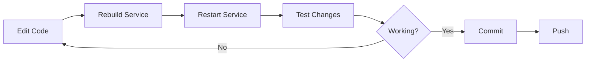

# JoustMania Development Guide

**Getting started with JoustMania development**

---

## Table of Contents

1. [Prerequisites](#prerequisites)
2. [Quick Start](#quick-start)
3. [Development Workflow](#development-workflow)
4. [Building Services](#building-services)
5. [Running Services](#running-services)
6. [Testing](#testing)
7. [Debugging](#debugging)
8. [Code Organization](#code-organization)
9. [Adding New Features](#adding-new-features)
10. [Best Practices](#best-practices)

---

## Prerequisites

### Required Software

- **Docker** (20.10+)
- **Docker Compose** (v2.0+)
- **Git**
- **Python** 3.11+ (for local development)
- **grpcurl** (for API testing)

### Optional Software

- **uv** (Python package manager)
- **make** (for convenience commands)
- **VS Code** (recommended IDE)

### Hardware (Optional)

- **PS Move Controllers** (for hardware testing)
- **USB Bluetooth Adapter** (class 1 recommended)
- **Raspberry Pi** or **Linux machine** (for full hardware testing)

### Installation

#### Docker

```bash
# Linux (using convenience script)
curl -fsSL https://get.docker.com -o get-docker.sh
sudo sh get-docker.sh
sudo usermod -aG docker $USER

# Log out and back in for group changes to take effect
```

#### grpcurl

```bash
# Linux
sudo apt-get install grpcurl

# macOS
brew install grpcurl

# Or download binary from https://github.com/fullstorydev/grpcurl/releases
```

#### uv (Python Package Manager)

```bash
curl -LsSf https://astral.sh/uv/install.sh | sh
export PATH="$HOME/.local/bin:$PATH"
```

---

## Quick Start

### 1. Clone the Repository

```bash
git clone <repository-url>
cd JoustMania
```

### 2. Build Docker Images

```bash
docker compose build --parallel
```

### 3. Start the Stack

```bash
docker compose up -d
```

### 4. Verify Services

```bash
# Check service status
docker compose ps

# Should show all services running (or Up)
```

### 5. Access UIs

- **Web UI:** http://localhost:80
- **Jaeger UI:** http://localhost:16686
- **Prometheus Metrics:** http://localhost:8888/metrics

### 6. View Logs

```bash
# All services
docker compose logs -f

# Specific service
docker compose logs -f controller-manager
```

### 7. Stop the Stack

```bash
docker compose down
```

---

## Development Workflow

### Typical Development Cycle



### Hot Reloading

Currently, services require rebuild after code changes. Future: Add volume mounts for hot reloading.

### Development Commands

```bash
# Rebuild specific service
docker compose build settings

# Restart specific service
docker compose restart settings

# Rebuild and restart
docker compose up -d --build settings

# View logs in real-time
docker compose logs -f settings
```

---

## Building Services

### Build All Services

```bash
docker compose build --parallel
```

### Build Single Service

```bash
docker compose build <service-name>
```

**Service names:**
- `settings`
- `controller-manager`
- `game-coordinator`
- `menu`
- `supervisor`
- `webui`
- `audio`

### Build Options

```bash
# No cache (clean build)
docker compose build --no-cache settings

# Pull latest base images
docker compose build --pull settings
```

### Understanding Multi-Stage Builds

Services use multi-stage Docker builds:

```dockerfile
# Stage 1: Build dependencies
FROM python:3.11-slim AS builder
RUN pip install uv
COPY pyproject.toml .
RUN uv sync

# Stage 2: Runtime
FROM python:3.11-slim
COPY --from=builder /app/.venv /app/.venv
COPY . .
CMD ["python", "server.py"]
```

**Benefits:**
- Smaller final images
- Faster builds (cached layers)
- Clean separation of build/runtime dependencies

---

## Running Services

### Run All Services

```bash
docker compose up -d
```

### Run Specific Services

```bash
# Only infrastructure
docker compose up -d redis jaeger otel-collector

# Only application services
docker compose up -d settings controller-manager game-coordinator menu
```

### Run in Foreground (with logs)

```bash
docker compose up
```

### Scale Services (Future)

```bash
# Run multiple game coordinators
docker compose up -d --scale game-coordinator=3
```

### Override Configuration

```bash
# Use custom compose file
docker compose -f docker-compose.yml -f docker-compose.dev.yml up -d
```

---

## Testing

### Unit Tests

```bash
# Run all tests
scripts/testing/run_tests.sh

# Run specific test file
PYTHONPATH=$(pwd) python -m pytest testing/test_controller_state.py

# Run with coverage
pytest --cov=core --cov=services testing/
```

### Integration Tests

```bash
# Test Settings service
pytest testing/test_settings_integration.py

# Test with real gRPC calls
python testing/test_settings_grpc.py
```

### Testing with grpcurl

#### List Services

```bash
grpcurl -plaintext localhost:50051 list
# Output: joustmania.SettingsService
```

#### List Methods

```bash
grpcurl -plaintext localhost:50051 list joustmania.SettingsService
# Output:
# joustmania.SettingsService.GetSettings
# joustmania.SettingsService.UpdateSetting
# joustmania.SettingsService.SubscribeToChanges
```

#### Call RPC

```bash
# GetSettings
grpcurl -plaintext -d '{}' localhost:50051 joustmania.SettingsService/GetSettings

# UpdateSetting
grpcurl -plaintext -d '{"key":"sensitivity","value":"3"}' \
    localhost:50051 joustmania.SettingsService/UpdateSetting

# Stream SubscribeToChanges
grpcurl -plaintext -d '{"pattern":"*"}' \
    localhost:50051 joustmania.SettingsService/SubscribeToChanges
```

#### Test All Services

```bash
# Settings (50051)
grpcurl -plaintext localhost:50051 list

# ControllerManager (50052)
grpcurl -plaintext localhost:50052 list

# GameCoordinator (50053)
grpcurl -plaintext localhost:50053 list

# Menu (50054)
grpcurl -plaintext localhost:50054 list

# Supervisor (50055)
grpcurl -plaintext localhost:50055 list

# Audio (50056)
grpcurl -plaintext localhost:50056 list
```

### Hardware Testing

```bash
# Test controller pairing
python tools/manualpair.py

# Test controller utilities
scripts/testing/controller_util_test.sh

# Interactive color test
cd scripts/testing/color_tests/
python interactive_colortest.py
```

---

## Debugging

### View Logs

```bash
# All services
docker compose logs -f

# Specific service
docker compose logs -f settings

# Last N lines
docker compose logs --tail=100 settings

# With timestamps
docker compose logs -f -t settings
```

### Access Container

```bash
# Get shell in running container
docker compose exec settings bash

# Or if bash not available
docker compose exec settings sh

# Run command in container
docker compose exec settings python -c "import sys; print(sys.version)"
```

### Inspect Container

```bash
# View container details
docker inspect joustmania-settings

# View environment variables
docker inspect joustmania-settings | jq '.[0].Config.Env'

# View mounts
docker inspect joustmania-settings | jq '.[0].Mounts'
```

### Debug gRPC Issues

```bash
# Enable gRPC debug logging
docker compose exec settings python -c "
import grpc
import logging
logging.basicConfig(level=logging.DEBUG)
"

# Test connection
grpcurl -plaintext -v localhost:50051 list
```

### View Traces in Jaeger

1. Open http://localhost:16686
2. Select service from dropdown (e.g., "joustmania-settings")
3. Click "Find Traces"
4. Click on trace to see details

**Useful filters:**
- Service: `joustmania-settings`
- Operation: `joustmania.SettingsService/GetSettings`
- Min Duration: `100ms` (find slow requests)
- Tags: `error=true` (find failures)

### Debug OpenTelemetry

```bash
# Check OTel Collector health
curl http://localhost:13133/

# View collector logs
docker compose logs -f otel-collector

# Test OTLP endpoint
grpcurl -plaintext localhost:4317 list
```

### Debug Network Issues

```bash
# Test service connectivity
docker compose exec settings nc -zv controller-manager 50052

# View network
docker network ls
docker network inspect joustmania_default

# DNS resolution
docker compose exec settings nslookup settings
```

### Performance Profiling

```bash
# Python profiling
docker compose exec settings python -m cProfile -s cumtime server.py

# Memory profiling
pip install memory_profiler
python -m memory_profiler services/settings/server.py
```

---

## Code Organization

### Project Structure

```
JoustMania/
├── core/                    # Shared infrastructure
│   ├── common.py           # Enums, constants
│   ├── controller_state.py # Shared memory state
│   ├── controller_process.py
│   ├── base_logger.py
│   └── grpc_clients.py
├── utils/                   # Utilities
│   ├── colors.py
│   ├── piaudio.py
│   ├── pair.py
│   ├── controller_util.py
│   └── playwav.py
├── services/                # 7 microservices
│   ├── settings/
│   │   ├── settings.proto
│   │   ├── server.py
│   │   ├── process.py (legacy)
│   │   ├── Dockerfile
│   │   └── pyproject.toml
│   ├── controller_manager/
│   ├── game_coordinator/
│   ├── menu/
│   ├── supervisor/
│   ├── webui/
│   └── audio/
├── testing/                 # Tests
│   ├── test_*.py
│   └── requirements.txt
├── scripts/                 # Helper scripts
│   ├── hardware/
│   ├── testing/
│   ├── setup/
│   └── docker/
├── docs/                    # Documentation
│   ├── ARCHITECTURE.md
│   ├── DEVELOPMENT.md
│   └── diagrams/
├── legacy/                  # Archived code
├── templates/               # Web UI templates
├── static/                  # Web UI static files
├── audio/                   # Audio files
├── docker-compose.yml
├── otel-collector-config.yaml
└── README.md
```

### Service Structure

Each service follows this pattern:

```
services/<service-name>/
├── <service>.proto          # gRPC service definition
├── <service>_pb2.py        # Generated protobuf (from .proto)
├── <service>_pb2_grpc.py   # Generated gRPC (from .proto)
├── server.py               # gRPC server implementation
├── process.py              # Legacy Queue-based (if exists)
├── Dockerfile              # Multi-stage build
├── pyproject.toml          # Python dependencies
├── __init__.py
└── README.md               # Service documentation
```

### Protobuf Code Generation

```bash
# Generate Python code from .proto file
cd services/settings/
python -m grpc_tools.protoc \
    -I. \
    --python_out=. \
    --grpc_python_out=. \
    settings.proto

# Or use Docker (if dependencies issues)
docker run --rm -v $(pwd):/workspace -w /workspace/services/settings \
    python:3.11-slim bash -c \
    "pip install -q grpcio-tools && \
     python -m grpc_tools.protoc -I. --python_out=. --grpc_python_out=. settings.proto"
```

### Import Conventions

```python
# Core modules
from core import common
from core.common import Games, Status
from core.controller_state import ControllerState

# Utilities
from utils import colors
from utils.piaudio import Audio

# gRPC
import grpc
from services.settings import settings_pb2, settings_pb2_grpc

# OpenTelemetry
from opentelemetry import trace
from opentelemetry.instrumentation.grpc import GrpcInstrumentorServer
```

---

## Adding New Features

### Adding a New Service

1. **Create Service Directory**

```bash
mkdir -p services/newservice
cd services/newservice
```

2. **Define Protobuf Schema**

```protobuf
// newservice.proto
syntax = "proto3";
package joustmania;

service NewService {
  rpc DoSomething(DoSomethingRequest) returns (DoSomethingResponse);
}

message DoSomethingRequest {
  string param = 1;
}

message DoSomethingResponse {
  bool success = 1;
  string message = 2;
}
```

3. **Generate Python Code**

```bash
python -m grpc_tools.protoc -I. --python_out=. --grpc_python_out=. newservice.proto
```

4. **Implement Server**

```python
# server.py
import grpc
from concurrent import futures
from opentelemetry.instrumentation.grpc import GrpcInstrumentorServer
import newservice_pb2
import newservice_pb2_grpc

class NewServiceServicer(newservice_pb2_grpc.NewServiceServicer):
    def DoSomething(self, request, context):
        # Implementation
        return newservice_pb2.DoSomethingResponse(
            success=True,
            message=f"Processed: {request.param}"
        )

def serve():
    server = grpc.server(futures.ThreadPoolExecutor(max_workers=10))

    # Instrument with OpenTelemetry
    GrpcInstrumentorServer().instrument_server(server)

    newservice_pb2_grpc.add_NewServiceServicer_to_server(
        NewServiceServicer(), server
    )

    server.add_insecure_port('[::]:50057')
    server.start()
    server.wait_for_termination()

if __name__ == '__main__':
    serve()
```

5. **Create Dockerfile**

```dockerfile
FROM python:3.11-slim AS builder
RUN pip install --no-cache-dir uv
WORKDIR /app
COPY pyproject.toml .
RUN uv sync --frozen

FROM python:3.11-slim
WORKDIR /app
COPY --from=builder /app/.venv /app/.venv
COPY . .
ENV PATH="/app/.venv/bin:$PATH"
ENV PYTHONUNBUFFERED=1
CMD ["python", "server.py"]
```

6. **Add to docker-compose.yml**

```yaml
newservice:
  build: ./services/newservice
  container_name: joustmania-newservice
  ports:
    - "50057:50057"
  environment:
    - OTEL_SERVICE_NAME=joustmania-newservice
    - OTEL_EXPORTER_OTLP_ENDPOINT=http://otel-collector:4317
  depends_on:
    - otel-collector
  restart: unless-stopped
```

7. **Test the Service**

```bash
# Build
docker compose build newservice

# Start
docker compose up -d newservice

# Test with grpcurl
grpcurl -plaintext localhost:50057 list
grpcurl -plaintext -d '{"param":"test"}' \
    localhost:50057 joustmania.NewService/DoSomething
```

### Adding a New RPC to Existing Service

1. Update `.proto` file
2. Regenerate Python code
3. Implement new method in Servicer class
4. Rebuild service
5. Test with grpcurl

### Adding a New Game Mode

See Phase 13 implementation plan for detailed game refactoring guide.

---

## Best Practices

### Code Style

- **Python:** Follow PEP 8
- **Docstrings:** Use Google style
- **Type hints:** Use where appropriate
- **Linting:** Use `ruff` or `pylint`

### gRPC Best Practices

1. **Use streaming for real-time data**
   ```python
   def StreamData(self, request, context):
       while True:
           yield DataResponse(...)
   ```

2. **Handle errors properly**
   ```python
   try:
       # ...
   except Exception as e:
       context.set_code(grpc.StatusCode.INTERNAL)
       context.set_details(str(e))
       return ErrorResponse()
   ```

3. **Add deadlines/timeouts**
   ```python
   with grpc.insecure_channel('localhost:50051') as channel:
       stub = SettingsStub(channel)
       response = stub.GetSettings(request, timeout=5.0)
   ```

### OpenTelemetry Best Practices

1. **Add spans for critical operations**
   ```python
   from opentelemetry import trace

   tracer = trace.get_tracer(__name__)

   with tracer.start_as_current_span("operation_name") as span:
       span.set_attribute("key", "value")
       # Do work
   ```

2. **Propagate context**
   ```python
   # Context automatically propagated in gRPC
   ```

3. **Add meaningful attributes**
   ```python
   span.set_attribute("setting.key", key)
   span.set_attribute("setting.value", value)
   span.set_attribute("validation.result", "success")
   ```

### Docker Best Practices

1. **Use multi-stage builds**
2. **Don't run as root** (add USER in Dockerfile)
3. **Use `.dockerignore`**
4. **Pin base image versions**
5. **Minimize layers**

### Testing Best Practices

1. **Write unit tests for business logic**
2. **Write integration tests for gRPC APIs**
3. **Mock external dependencies**
4. **Test error cases**
5. **Use fixtures for common setup**

---

## Troubleshooting

### Common Issues

#### Services won't start

```bash
# Check logs
docker compose logs <service>

# Check if ports are in use
sudo netstat -tulpn | grep 5005

# Rebuild from scratch
docker compose down
docker compose build --no-cache
docker compose up -d
```

#### gRPC connection refused

```bash
# Verify service is running
docker compose ps

# Test with grpcurl
grpcurl -plaintext localhost:50051 list

# Check service logs for errors
docker compose logs settings
```

#### Permission denied (hardware access)

```bash
# Ensure containers are privileged
# Check docker-compose.yml for:
privileged: true
devices:
  - /dev/bus/usb:/dev/bus/usb
```

#### Traces not appearing in Jaeger

```bash
# Check OTel Collector
docker compose logs otel-collector

# Verify OTLP endpoint
docker compose exec settings env | grep OTEL

# Test trace export
grpcurl -plaintext localhost:4317 list
```

---

## Resources

- [Architecture Documentation](ARCHITECTURE.md)
- [gRPC Python Guide](https://grpc.io/docs/languages/python/)
- [OpenTelemetry Python](https://opentelemetry.io/docs/instrumentation/python/)
- [Docker Compose Reference](https://docs.docker.com/compose/compose-file/)
- [grpcurl Documentation](https://github.com/fullstorydev/grpcurl)

---

## Getting Help

- **Issues:** https://github.com/anthropics/joustmania/issues
- **Discussions:** https://github.com/anthropics/joustmania/discussions
- **Documentation:** Browse `docs/` directory

---

Happy coding! 🎮
